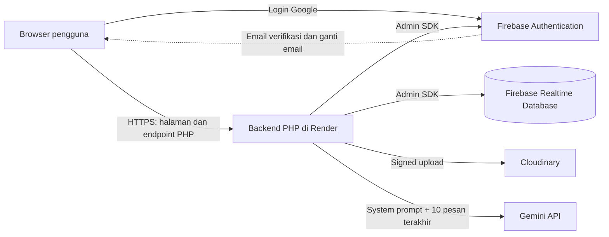

# Senara

Ruang tenang untuk jurnal harian, afirmasi, dan bercerita bersama Nomi.

Senara adalah website refleksi diri berbasis layanan cloud. Pengguna bisa membaca afirmasi harian, menulis jurnal momen berharga lengkap dengan foto, melihat kembali jurnalnya dalam kalender arsip, dan bercerita kepada **Nomi**, teman bicara virtual yang hangat, empatik, dan menenangkan (ditenagai Gemini API).

**Website:** `https://<nama-service>.onrender.com` <!-- TODO: ganti dengan URL Render setelah deploy, contoh: [https://senara.onrender.com](https://senara.onrender.com) -->

## Tim

| Nama |
|---|
| Dessica Suhaedi Hartono |
| Khadijatul Kubro |

## Persyaratan Proyek

Website dibangun untuk memenuhi persyaratan berikut:

- Berbasis layanan cloud, dengan **Firebase** sebagai layanan wajib.
- **12 fungsi CRUD** (3 Create, 3 Read, 3 Update, 3 Delete) yang terhubung ke **Firebase Realtime Database**.
- **Register dan login** menggunakan **Firebase Authentication**.
- **Web mailer** lewat Firebase: setelah register, pengguna menerima email verifikasi.

## Fitur

### Landing page (sebelum login)

Slider 4 slide: perkenalan Senara, contoh afirmasi harian (berganti acak setiap halaman dimuat), perkenalan Nomi, dan ajakan mendaftar. Tombol masuk dan daftar ada di bagian ajakan di bawah slider.

### Registrasi dan login

- Form registrasi: **nama lengkap**, **email**, **kata sandi** (minimal 6 karakter), dan **konfirmasi kata sandi**. Tersedia juga **Login with Google**.
- Setelah registrasi, Firebase mengirim **email verifikasi**. Login dengan email **hanya berhasil jika email sudah diverifikasi**; akun Google dianggap sudah terverifikasi. Email verifikasi bisa dikirim ulang dengan jeda 60 detik.
- *Email Enumeration Protection* aktif, sehingga akun yang tidak ditemukan dan kata sandi yang salah sama-sama ditampilkan sebagai "Email atau kata sandi salah".
- Nama lengkap disimpan utuh, tetapi sapaan di aplikasi hanya memakai nama depan (misalnya "Hi, Seno").
- Semua halaman setelah login (Dashboard, Nomi, Journaling, Arsip, Profil) hanya bisa dibuka oleh pengguna yang sudah login.

### Afirmasi harian

- Dataset **365 kalimat afirmasi** disimpan di Realtime Database.
- Setiap halaman dimuat, backend memilih satu nomor acak 1 sampai 365 yang **berbeda dari afirmasi terakhir** yang tampil, lalu hanya membaca satu kalimat itu.
- Afirmasi hanya untuk dibaca dan dibagikan (tombol Bagikan); tidak disimpan ke akun pengguna.

### Chat dengan Nomi (Gemini API)

- Nomi berkarakter pendengar yang hangat dan empatik, menjawab singkat dalam bahasa Indonesia santai. Nomi bukan psikolog: tidak memberi diagnosis atau saran obat. Bila pengguna menyebut ingin menyakiti diri, Nomi mendorongnya menghubungi orang terpercaya, layanan kesehatan jiwa **119 ext. 8**, atau layanan darurat **112**.
- Riwayat chat tersimpan per pengguna di `chats/{uid}` dan **dimuat bertahap**:
  - Saat halaman dibuka: pesan **3 hari terakhir**. Bila kurang dari 20 pesan, yang dimuat adalah **20 pesan terakhir**, sehingga ruang chat tidak kosong selama masih ada riwayat (maksimal 200 pesan sebagai pengaman).
  - Saat digulir ke atas: **30 pesan sebelumnya** dimuat dan disisipkan tanpa menggeser posisi baca.
- Gemini hanya menerima **10 pesan terakhir** sebagai konteks, berapa pun panjang riwayatnya, supaya hemat token dan kuota.
- Pengguna bisa menghapus satu pesan atau membersihkan seluruh riwayat chat.
- **Mode Tenang:** latihan napas terpandu dari menu ⋯ di room chat. Pop-up dengan gradien bergerak menampilkan "Persiapkan dirimu tunggu instruksi dari Nomi" selama 4 detik, lalu instruksi berulang setiap 3 detik: *Tarik Napas → Tahan Sejenak → Hembuskan Perlahan → Rileks*. Fitur ini berjalan sepenuhnya di browser, tanpa menyimpan data dan tanpa memanggil Gemini.

### Journaling

- Form berisi **tanggal**, **foto**, dan **catatan** (maksimal 2000 karakter). Minimal salah satu dari foto atau catatan harus diisi.
- **Satu jurnal per tanggal.** Jika tanggal yang dipilih sudah punya jurnal, form otomatis membuka mode Edit.
- Tanggal bisa dipilih mundur, tetapi tidak untuk tanggal yang belum terjadi (berdasarkan WIB, dengan toleransi satu hari untuk zona waktu yang lebih maju).

### Penyimpanan foto (Cloudinary)

Foto jurnal dan foto profil disimpan di **Cloudinary**. Firebase Storage tidak dipakai karena project Firebase baru wajib memakai paket Blaze (berbayar) untuk Storage, sedangkan Cloudinary punya paket gratis tanpa kartu kredit.

Alur upload:

1. Pengguna memilih foto (maksimal 10 MB sebelum kompresi).
2. Browser otomatis mengecilkan foto ke **lebar maksimal 1080 px** dan mengompresnya ke **WebP** (cadangan JPEG) dengan **kualitas 0.8**. Foto HP sekitar 5 MB turun ke kisaran 200 sampai 400 KB.
3. Backend memeriksa isi file (harus JPG, PNG, atau WebP), lalu mengunggahnya ke Cloudinary dengan *signed upload*. API secret Cloudinary hanya ada di server.
4. Database hanya menyimpan **URL** foto pada field `photoUrl`.

| Foto | Lokasi di Cloudinary | Keterangan |
|---|---|---|
| Foto profil | `senara/avatars/{uid}` | Dipotong menjadi persegi 400 × 400 px saat diunggah |
| Foto jurnal | `senara/journals/{uid}/{dateKey}` | Satu foto per jurnal |

Karena lokasinya ditentukan dari uid dan tanggal, foto baru selalu menimpa foto lama di tempat yang sama, sehingga tidak ada file lama yang tertinggal. Saat jurnal atau akun dihapus, fotonya ikut dihapus dari Cloudinary.

### Arsip

- Kalender bulanan yang bersih; tanggal yang punya jurnal diberi penanda titik.
- Klik tanggal untuk melihat detail jurnal di panel samping (di layar kecil, di bawah kalender) bergaya kartu postingan: foto di atas, catatan di bawah, dengan tombol **Edit** dan **Hapus**.
- Tanggal tanpa jurnal menampilkan ajakan untuk menulis jurnal di tanggal itu.
- Ringkasan bulan: jumlah momen tersimpan dan persentase konsistensi refleksi.

### Profil

| Bagian | Keterangan |
|---|---|
| **Nama lengkap** | Bisa diubah; nama depannya dipakai untuk sapaan. |
| **Bio** | Kutipan diri maksimal 160 karakter, ditulis dan diedit langsung di banner profil lewat ikon pena. |
| **Foto profil** | Bisa diganti (JPG atau PNG, maksimal 3 MB). |
| **Alamat email** | Akun email dan kata sandi bisa **mengganti email dengan verifikasi ulang**: masukkan email baru dan kata sandi, lalu Firebase mengirim link verifikasi ke email baru. Email baru **baru berlaku setelah link diklik**, jadi salah ketik email tidak membuat akun terkunci, dan Firebase juga memberi tahu email lama. Email akun Google mengikuti akun Google sehingga tidak bisa diganti. |
| **Tanggal bergabung** | Hanya dibaca. |
| **Streak** | Jumlah hari berturut-turut menulis jurnal. Karena jurnal bisa diisi untuk tanggal yang sudah lewat, streak dihitung ulang setiap kali jurnal dibuat atau dihapus. |
| **Ubah kata sandi** | Mengirim email reset kata sandi dari Firebase ke email akun yang aktif. |
| **Hapus akun** | Menghapus profil, jurnal, penanda tanggal, riwayat chat, foto di Cloudinary, lalu akun Firebase Auth. Wajib konfirmasi kata sandi (atau login Google ulang). |

## Teknologi

| Komponen | Teknologi |
|---|---|
| Frontend | HTML, CSS, dan JavaScript (ES modules) tanpa framework |
| Backend | PHP 8.3+ dengan [kreait/firebase-php](https://github.com/kreait/firebase-php) (Firebase Admin SDK) |
| Autentikasi dan email verifikasi | Firebase Authentication |
| Database | Firebase Realtime Database |
| Penyimpanan foto | Cloudinary (paket gratis) |
| Chatbot AI | Google Gemini API |
| Hosting | Render (paket gratis), menyajikan frontend dan backend dari satu tempat |

## Arsitektur

Senara memakai arsitektur **klien + Firebase (Backend-as-a-Service) + backend PHP tipis** di Render.



| Alur | Penjelasan |
|---|---|
| **Registrasi dan login** | Registrasi dan login email dikirim lewat form ke backend PHP, yang memanggil Firebase Authentication lewat Admin SDK. Login Google dilakukan browser lewat Firebase SDK, lalu ID token-nya diverifikasi backend. Setelah berhasil, backend menyimpan `uid` di session. |
| **Baca dan tulis data** | Browser memanggil endpoint PHP; backend membaca dan menulis data di Realtime Database lewat Admin SDK, hanya pada path milik `uid` yang sedang login. |
| **Upload foto** | Foto dikompres di browser, lalu backend mengunggahnya ke Cloudinary dan menyimpan URL-nya di database. |
| **Chat Nomi** | Backend mengirim system prompt Nomi dan pesan terakhir ke Gemini API, menyimpan balasannya, lalu meneruskannya ke browser. |
| **Web mailer** | Email verifikasi (dan link ganti email) dikirim oleh server Firebase, jadi tidak perlu layanan email tambahan. Tidak ada email lain seperti welcome email. |

**Kenapa arsitektur ini:**

- **Sesuai persyaratan:** Firebase Auth, Realtime Database, dan web mailer terpakai langsung.
- **Rahasia tetap aman:** service account Firebase, API key Gemini, dan API secret Cloudinary hanya ada di server. Kalau dipakai langsung dari browser, semuanya bisa dilihat siapa saja.
- **Keamanan berlapis:** Security Rules menolak akses langsung dari browser, dan backend hanya mengakses data milik pengguna yang sedang login. Kuota Gemini juga tidak bisa dipakai pihak luar.
- **Biaya rendah:** semua layanan memakai paket gratis.

**Konsekuensi yang perlu diketahui:**

- Realtime Database tidak mendukung join dan query kompleks, jadi struktur datanya dirancang khusus (lihat [Struktur Database](#struktur-database)).
- Render paket gratis "tidur" saat lama tidak dipakai, sehingga permintaan pertama setelahnya bisa lambat beberapa detik.

## Struktur Folder

```
Senara-Project/
├── config/
│   └── firebase_config.php      # inisialisasi Firebase Admin SDK ($auth, $database)
├── public/                      # root web (yang disajikan ke browser)
│   ├── *.html                   # halaman: index, login, registrasi, cek-email, dashboard,
│   │                            #          nomi-chat, journaling, arsip, profil
│   ├── actions/                 # endpoint PHP (auth, profil, jurnal, chat, afirmasi, dll.)
│   ├── css/                     # variables, base, layout, components, dan css per halaman
│   ├── js/
│   │   ├── components/          # app-shell (sidebar & bottom nav), modal, toast, form
│   │   ├── pages/               # skrip per halaman
│   │   ├── services/            # pemanggil endpoint PHP (userService, journalService, chatService, ...)
│   │   └── utils/
│   └── assets/images/
├── src/                         # logika backend bersama (session, users, journals, chat, cloudinary, verification)
├── composer.json
└── README.md
```

## Menjalankan Secara Lokal

### 1. Prasyarat

- PHP 8.3 atau lebih baru
- [Composer](https://getcomposer.org/)
- Project Firebase dengan **Authentication** dan **Realtime Database** aktif
- Akun Cloudinary dan API key Gemini ([Google AI Studio](https://aistudio.google.com/apikey))

### 2. Pasang dependensi

```bash
composer install
```

### 3. Atur Firebase Console

- **Authentication → Sign-in method:** aktifkan *Email/Password* dan *Google*.
- **Authentication → Settings → Authorized domains:** tambahkan `localhost` dan domain Render. Domain ini dipakai link verifikasi email dan ganti email.
- **Authentication → Settings → User actions:** aktifkan *Email enumeration protection*.
- **Realtime Database → Rules:** tolak semua akses langsung dari browser (backend tetap bisa mengakses lewat Admin SDK):

  ```json
  {
    "rules": {
      ".read": false,
      ".write": false
    }
  }
  ```

- **Realtime Database → Data:** isi node `affirmations` dengan 365 kalimat afirmasi (kunci `1` sampai `365`).

## Struktur Database

Realtime Database menyimpan data sebagai satu pohon JSON. Data dipisah per jenis, lalu per pengguna (`uid`), sehingga setiap pengguna punya "laci" sendiri dan membaca profil tidak ikut menarik semua jurnal atau chat.

```
users
  {uid}
    name, email, bio, photoUrl, createdAt
    pendingEmail                   hanya ada selama ganti email menunggu verifikasi
    stats
      streak, lastCheckIn
journals
  {uid}
    {dateKey}                      contoh: 2026-09-29
      note, photoUrl, photoName, createdAt, updatedAt
journalDates
  {uid}
    {dateKey}: true
affirmations
  1: "teks afirmasi ke-1"
  ...
  365: "teks afirmasi ke-365"
chats
  {uid}
    {messageId}                    kunci dari push(), otomatis urut waktu
      sender, text, createdAt
```

| Path | Isi | Kapan dibaca |
|---|---|---|
| `users/{uid}` | Profil dan statistik ringkas | Setiap halaman setelah login (sidebar) dan halaman Profil |
| `journals/{uid}/{dateKey}` | Isi lengkap jurnal pada tanggal itu | Saat membuka jurnal di Journaling atau Arsip |
| `journalDates/{uid}/{dateKey}` | Penanda tanggal yang punya jurnal | Saat membuka kalender bulanan dan menghitung streak |
| `affirmations/{1..365}` | Kalimat afirmasi | Satu node acak setiap halaman dimuat |
| `chats/{uid}/{messageId}` | Riwayat percakapan dengan Nomi | Saat membuka chat (3 hari terakhir, minimal 20 pesan) dan saat menggulir ke atas (30 pesan per muat) |

**Keterangan field:**

| Field | Tipe dan isi |
|---|---|
| `name`, `email`, `bio` | String. `email` disalin dari Firebase Auth dan disamakan lagi setelah pengguna mengganti email; email di Auth tetap sumber utamanya. `bio` boleh kosong. |
| `pendingEmail` | String, opsional. Email baru yang link verifikasinya belum diklik; dihapus otomatis setelah penggantian selesai. |
| `photoUrl` | URL dari Cloudinary, atau tidak ada jika tidak ada foto. Foto profil akun Google memakai foto Google sampai pengguna menggantinya. |
| `photoName` | Nama file asli foto jurnal, ditampilkan di form edit. |
| `note` | Catatan jurnal, maksimal 2000 karakter. |
| `sender` | `"user"` atau `"nomi"`. |
| `createdAt`, `updatedAt` | Waktu ISO 8601 (UTC), contoh `"2026-10-02T08:30:00Z"`. |
| `stats.streak` | Jumlah hari berturut-turut yang punya jurnal. |
| `stats.lastCheckIn` | `dateKey` jurnal terbaru. |
| `dateKey` | Tanggal berformat `yyyy-mm-dd`. Karena jurnal hanya satu per tanggal, tanggal langsung dipakai sebagai kunci, jadi tidak perlu `journalId`. |

## Optimasi Database

Realtime Database mengunduh seluruh isi node yang dibaca dan tidak punya join, jadi setiap aksi dirancang untuk membaca data sesedikit mungkin.

| Teknik | Cara kerja | Yang dihemat |
|---|---|---|
| **Struktur datar per pengguna** | Jurnal, profil, dan chat ditaruh di node terpisah, bukan bersarang di dalam `users`. | Membaca profil tidak menarik data jurnal dan chat. |
| **Kunci tanggal + query per bulan** | Kalender Oktober cukup mengambil `orderByKey().startAt("2026-10-01").endAt("2026-10-31")`, tanpa index tambahan. | Tidak mengunduh semua jurnal untuk membuka kalender. |
| **Penanda `journalDates`** | Kalender hanya membaca pasangan tanggal dan `true`, ditulis bersamaan dengan jurnal dalam satu multi-path update. | Kalender tampil tanpa membaca isi jurnal. |
| **Streak tersimpan** | Streak disimpan di `users/{uid}/stats` dan dihitung ulang dari `journalDates` saat jurnal dibuat atau dihapus. | Profil tidak menghitung dari semua jurnal. |
| **Foto di Cloudinary + kompres** | Database hanya menyimpan URL; foto dikompres di browser sebelum diunggah. | Ukuran database kecil, penyimpanan foto hemat. |
| **Afirmasi 1 node acak** | Backend hanya membaca satu kalimat `affirmations/{n}`, bukan 365 kalimat. | Satu baca kecil per muat halaman, tanpa kuota Gemini. |
| **Chat dimuat bertahap** | 3 hari terakhir (minimal 20 pesan), lalu 30 pesan per gulir. Rentang 3 hari dicari dari kunci `push()`, yang 8 karakter pertamanya adalah waktu pembuatan, jadi tidak perlu index. | Kecepatan memuat tidak bergantung pada panjang riwayat maupun jumlah pengguna. |
| **Konteks Gemini terbatas** | Gemini hanya menerima 10 pesan terakhir. | Token dan kuota Gemini. |
| **Baca sekali per permintaan** | Backend membaca data sekali per request (`getValue`), tanpa listener realtime. | Koneksi dan bandwidth. |
| **Rules tolak semua + validasi di PHP** | Lihat [Keamanan](#keamanan). | Mencegah data sampah dan akses lintas pengguna. |

Sebagai gambaran kapasitas: satu pesan chat sekitar 200 byte, sehingga 1 GB penyimpanan Realtime Database muat sekitar 5 juta pesan. Batas paket gratis Firebase bisa berubah, jadi pantau penggunaannya di Firebase Console.

## Fungsi CRUD

### 12 Fungsi CRUD Utama

Sesuai persyaratan proyek, Senara memiliki 12 fungsi CRUD (3 Create, 3 Read, 3 Update, 3 Delete) yang terhubung ke Firebase Realtime Database.

| No. dan Operasi | Fungsi dan Fitur | Path dan Data (Realtime Database) |
|---|---|---|
| **Create 1** | Registrasi: membuat profil pengguna | `users/{uid}`: name, email, createdAt, stats awal |
| **Create 2** | Journaling: menyimpan jurnal baru | `journals/{uid}/{dateKey}` dan `journalDates/{uid}/{dateKey}` |
| **Create 3** | Chat Nomi: menyimpan pesan pengguna dan balasan Nomi | `chats/{uid}/{messageId}` |
| **Read 1** | Arsip: membuka jurnal pada tanggal terpilih (panel detail) | `journals/{uid}/{dateKey}` |
| **Read 2** | Arsip: menampilkan kalender bulanan | `journalDates/{uid}`, query per bulan |
| **Read 3** | Profil: membaca data diri dan statistik | `users/{uid}` |
| **Update 1** | Edit jurnal (catatan, foto) | `journals/{uid}/{dateKey}`: note, photoUrl, updatedAt |
| **Update 2** | Simpan perubahan profil (nama lengkap, bio) | `users/{uid}` |
| **Update 3** | Ganti foto profil (avatar) | `users/{uid}/photoUrl` |
| **Delete 1** | Hapus jurnal di panel detail, termasuk foto di Cloudinary | `journals`, `journalDates`, dan `stats` |
| **Delete 2** | Hapus satu pesan atau bersihkan riwayat chat Nomi | `chats/{uid}` |
| **Delete 3** | Hapus akun beserta seluruh datanya | `users`, `journals`, `journalDates`, `chats`, Cloudinary, Firebase Auth |

### Daftar Lengkap Operasi

Dalam alur website yang sebenarnya, ada lebih banyak operasi baca dan tulis ke Realtime Database dan Cloudinary. Totalnya **28 operasi: 6 Create, 11 Read, 7 Update, 4 Delete**. Kolom "Fungsi Utama" menunjukkan operasi mana yang termasuk dalam 12 fungsi di atas.

**Create**

| No. | Operasi | Path / Tempat | Fungsi di kode | Fungsi Utama |
|---|---|---|---|---|
| **C1** | Registrasi email: membuat profil pengguna | `users/{uid}`: name, email, createdAt, stats awal | form registrasi → `actions/register.php` | Create 1 |
| **C2** | Login Google pertama kali: membuat profil jika belum ada | `users/{uid}` | `googleAuth.signInWithGoogle` → `actions/google_login.php` | - |
| **C3** | Menyimpan jurnal baru | `journals/{uid}/{dateKey}` dan `journalDates/{uid}/{dateKey}` | `journalService.saveJournal` | Create 2 |
| **C4** | Mengunggah foto jurnal | Cloudinary, lalu photoUrl di jurnal | `journalService.saveJournal` | - |
| **C5** | Menyimpan pesan pengguna di chat Nomi | `chats/{uid}/{messageId}` | `chatService.sendMessage` | Create 3 |
| **C6** | Menyimpan balasan Nomi | `chats/{uid}/{messageId}` | `chatService.getNomiReply` | Create 3 |

**Read**

| No. | Operasi | Path / Tempat | Fungsi di kode | Fungsi Utama |
|---|---|---|---|---|
| **R1** | Nama dan avatar di sidebar (setiap halaman setelah login) | `users/{uid}` | `userService.getProfile` | - |
| **R2** | Profil: data diri dan statistik | `users/{uid}` | `userService.getProfile`, `journalService.getStreak` | Read 3 |
| **R3** | Dashboard: afirmasi acak | `affirmations/{n}` | `affirmationService.getRandomAffirmation` | - |
| **R4** | Dashboard: streak dan status 5 hari terakhir | `users/{uid}/stats` dan `journalDates/{uid}` | `journalService.getStreak` | - |
| **R5** | Journaling: membuka jurnal pada tanggal tertentu | `journals/{uid}/{dateKey}` | `journalService.getJournalByDate` | - |
| **R6** | Journaling: mode Sunting mencari jurnal terakhir | `journals/{uid}`, limitToLast(1) | `journalService.getJournals` | - |
| **R7** | Arsip: kalender bulanan (tanggal yang punya jurnal) | `journalDates/{uid}`, query per bulan | `journalService.getJournals` | Read 2 |
| **R8** | Arsip: ringkasan bulan (jumlah momen, konsistensi %) | `journalDates/{uid}`, query per bulan | `journalService.getMonthSummary` | - |
| **R9** | Arsip: panel detail jurnal pada tanggal terpilih | `journals/{uid}/{dateKey}` | `journalService.getJournals` | Read 1 |
| **R10** | Chat Nomi: memuat riwayat percakapan (3 hari terakhir, minimal 20 pesan) | `chats/{uid}`, orderByKey().startAt(), limitToLast | `chatService.getMessages` | - |
| **R11** | Chat Nomi: memuat 30 pesan lama saat menggulir ke atas | `chats/{uid}`, orderByKey().endAt(id), limitToLast(31) | `chatService.getOlderMessages` | - |

**Update**

| No. | Operasi | Path / Tempat | Fungsi di kode | Fungsi Utama |
|---|---|---|---|---|
| **U1** | Edit catatan jurnal | `journals/{uid}/{dateKey}`: note, updatedAt | `journalService.saveJournal` | Update 1 |
| **U2** | Ganti foto jurnal (foto lama ditimpa di Cloudinary) | Cloudinary dan `journals/{uid}/{dateKey}`: photoUrl | `journalService.saveJournal` | Update 1 |
| **U3** | Hapus foto dari jurnal tanpa menghapus jurnalnya | Cloudinary dan `journals/{uid}/{dateKey}`: photoUrl = null | `journalService.saveJournal` (removePhoto) | - |
| **U4** | Simpan perubahan profil (nama lengkap, bio) | `users/{uid}`: name, bio | `userService.updateProfile` | Update 2 |
| **U5** | Ganti foto profil (avatar) | Cloudinary dan `users/{uid}/photoUrl` | `userService.updateProfilePhoto` | Update 3 |
| **U6** | Hitung ulang streak setelah jurnal dibuat atau dihapus | `users/{uid}/stats`: streak, lastCheckIn | `journalService` (saat simpan/hapus) | - |
| **U7** | Ganti alamat email (berlaku setelah link verifikasi diklik) | Firebase Auth email, `users/{uid}`: pendingEmail, email | `userService.changeEmail` | - |

**Delete**

| No. | Operasi | Path / Tempat | Fungsi di kode | Fungsi Utama |
|---|---|---|---|---|
| **D1** | Hapus jurnal beserta fotonya (dari Journaling dan Arsip) | `journals`, `journalDates`, Cloudinary, dan stats | `journalService.deleteJournal` | Delete 1 |
| **D2** | Hapus satu pesan chat | `chats/{uid}/{messageId}` | `chatService.deleteMessage` | Delete 2 |
| **D3** | Bersihkan seluruh riwayat chat | `chats/{uid}` | `chatService.clearMessages` | Delete 2 |
| **D4** | Hapus akun beserta seluruh datanya | `users`, `journals`, `journalDates`, `chats`, Cloudinary, Firebase Auth | `userService.deleteAccount` | Delete 3 |

**Tidak dihitung sebagai CRUD database**

- Operasi Firebase Auth: login email, login Google, logout, cek dan kirim ulang email verifikasi, reset password, dan login ulang sebelum hapus akun.
- Data statis di frontend: pertanyaan pemantik jurnal (`journalService.getRandomPrompt`), tombol pertanyaan cepat di chat Nomi (`chatService.getQuickPrompts`), dan langkah latihan napas Mode Tenang di chat Nomi.

## Keamanan

- **Security Rules menolak semua akses langsung dari browser** (`.read` dan `.write` bernilai `false`). Backend PHP memakai service account (Admin SDK) sehingga tetap bisa mengakses database.
- **Akses per pengguna:** setiap endpoint mengambil `uid` dari session login, bukan dari input browser, lalu hanya membaca atau menulis path milik `uid` tersebut.
- **Validasi di backend:** sebelum menulis, PHP memeriksa format dan isi data, misalnya `dateKey` berformat `yyyy-mm-dd` dan tanggalnya valid, `note` maksimal 2000 karakter, dan `sender` bernilai `"user"` atau `"nomi"`.
- **Afirmasi** juga dibaca lewat endpoint PHP, termasuk untuk landing page, sehingga node `affirmations` tidak perlu dibuka untuk umum.
- **Verifikasi dan konfirmasi akun:** login email diblokir sampai email terverifikasi. Ganti email meminta kata sandi dan baru berlaku setelah email baru diverifikasi; hapus akun meminta kata sandi atau login Google ulang; ubah kata sandi dilakukan lewat link yang dikirim ke email akun.
- **File rahasia** (`firebase_credentials.json`, `firebase_web_config.php`, `gemini_config.php`, `cloudinary_config.php`) tidak masuk git dan berada di luar folder `public`. Service account punya akses penuh ke database, jadi file ini tidak boleh dibagikan.

## Keputusan Desain

- Deploy tunggal di Render; Firebase dipakai sebagai layanan backend (Auth dan Realtime Database), bukan hosting.
- Foto disimpan di Cloudinary karena Firebase Storage pada project baru wajib paket Blaze.
- Web mailer hanya mengirim email verifikasi (dan link ganti email) lewat Firebase Authentication; tidak ada welcome email.
- Satu jurnal per tanggal, dengan `dateKey` (`yyyy-mm-dd`) sebagai kunci database. Jurnal berisi tanggal, foto, dan catatan.
- Afirmasi 365 kalimat diisi sekali lewat Firebase Console atau skrip admin, dan tidak disimpan per pengguna.
- Registrasi meminta nama lengkap; sapaan di aplikasi hanya memakai nama depan.
- Gemini dipilih sebagai mesin chatbot karena memiliki paket gratis.

## Catatan UI

**Font** (Google Fonts, didefinisikan sebagai variabel di `public/css/variables.css`):

| Font | Variabel | Dipakai untuk |
|---|---|---|
| Bricolage Grotesque | `--font-display` | Judul dan nama brand "Senara" di sidebar |
| Nunito Sans | `--font-body` | Teks biasa: paragraf, tombol, label menu, form |
| Fraunces (serif) | `--font-serif` | Nama brand di header landing page |
| Material Symbols Outlined | - | Ikon |

**Navigasi:**

- **Desktop/tablet** (lebar 768 px ke atas): sidebar kiri berisi Beranda, Nomi, Journaling, dan Arsip. Halaman Profil dibuka lewat kartu nama pengguna di kiri bawah sidebar.
- **Mobile** (di bawah 768 px): sidebar diganti bottom nav dengan label Beranda, Nomi, Journal, Arsip, dan Profil.
- Daftar menu diatur di satu tempat, yaitu `public/js/components/app-shell.js`.
