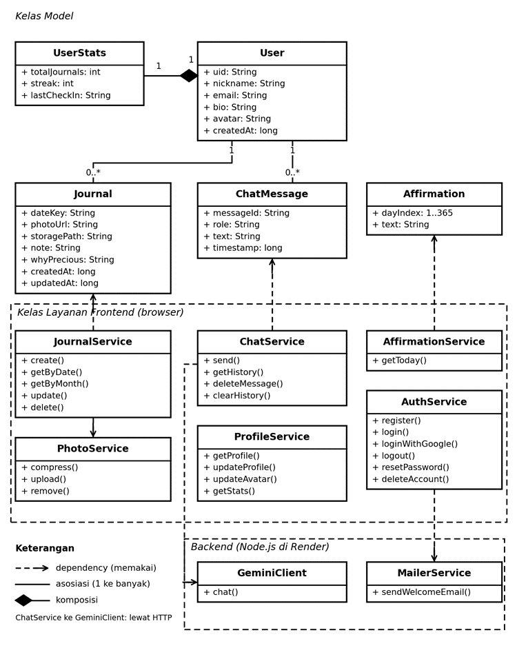

**SENARA**

PODUCT REQUIREMENT DOCUMENT

Rencana Pengembangan dan Rancangan Teknis Website Afirmasi & Jurnal Harian

**Isi dokumen**

**A. Rencana Pengembangan:** 1 Ringkasan Proyek, 2 Persyaratan Teknis, 3 Struktur Halaman dan Fitur, 4 Halaman Registrasi, 5 Dashboard Profile, 6 Pemetaan CRUD.

**B. Rancangan Teknis:** 7 Arsitektur Sistem, 8 Alasan Memilih Arsitektur, 9 Class Diagram, 10 Struktur Database, 11 Cara Mengoptimasi Database, 12 Keputusan dan Catatan untuk Tim.

**A. RENCANA PENGEMBANGAN**

# **1. Ringkasan Proyek**

| **Aspek**        | **Keterangan**                                                                                    |
|------------------|---------------------------------------------------------------------------------------------------|
| **Nama Website** | Senara                                                                                            |
| **Konsep**       | Ruang aman untuk refleksi diri, afirmasi harian, teman bicara virtual, dan jurnal momen berharga. |
| **Tim**          | 2 orang (pengembang dan teman)                                                                    |
| **Deadline**     | 20 Oktober 2026                                                                                   |
| **Karakter AI**  | Nomi, teman bicara virtual yang hangat, empatik, dan menenangkan.                                 |

# **2. Persyaratan Teknis**

Buatlah website berbasis layanan cloud. Layanan cloud yang wajib ada adalah Firebase. Rekan-rekan dapat memilih bahasa pemrograman yang digunakan.  
Requirements:

- Wajib ada total 12 CRUD (misal 3 fungsi create, 3 fungsi read, 3 fungsi update, dan 3 fungsi delete) yang dikoneksikan ke *Firebase Realtime Database*.

- Wajib ada fitur register dan login menggunakan *Firebase Authentication*.

- Wajib ada fitur *webmailer* menggunakan Firebase yaitu setelah user register akan dikirim email untuk verifikasi.

| **Komponen**         | **Ketentuan**                                                                                                                                                                                                    |
|----------------------|------------------------------------------------------------------------------------------------------------------------------------------------------------------------------------------------------------------|
| **Database**         | Firebase Realtime Database                                                                                                                                                                                       |
| **Autentikasi**      | Firebase Auth: login dengan Email & Password, ditambah Login with Google. Login email hanya berhasil jika email sudah diverifikasi.                                                                              |
| **Email**            | Verifikasi email: Firebase Authentication (sendEmailVerification) setelah registrasi. Tidak ada email lain selain verifikasi. |
| **Penyimpanan Foto** | Cloudinary (paket gratis); backend PHP mengunggah foto, URL foto disimpan di Realtime Database                                                                                                                  |
| **Chatbot AI**       | Gemini API (dipilih karena gratis)                                                                                                                                                                               |
| **Hosting / Deploy** | Render (paket gratis)                                                                                                                                                                                            |

# **3. Struktur Halaman & Fitur**

## **3.1 Landing Page (Sebelum Login)**

Halaman awal berupa slider geser dengan 4 slide untuk menarik perhatian pengunjung:

| **Slide**   | **Judul**                 | **Isi**                                                                                                                                                                                                                    |
|-------------|---------------------------|----------------------------------------------------------------------------------------------------------------------------------------------------------------------------------------------------------------------------|
| **Slide 1** | Tentang Senara            | Pengenalan singkat Senara sebagai ruang aman untuk refleksi dan afirmasi harian.                                                                                                                                           |
| **Slide 2** | Daily Affirmation Preview | Kutipan afirmasi untuk umum, berganti acak setiap kali halaman dimuat. Tombol "Afirmasi Harian" di header langsung membuka slide ini.                                                                                                                                                     |
| **Slide 3** | Kenalan dengan Nomi       | Perkenalan Nomi sebagai teman bicara virtual, dengan tombol "Sapa Nomi Sekarang" ke Registrasi.                                                                                                                                                     |
| **Slide 4** | Mulai / Registrasi        | Tombol aksi cepat ke Registrasi. Tombol Login ("Masuk ke Akunmu") berada di bagian ajakan (CTA) di bawah slider, berdampingan dengan tombol Daftar. Registrasi memicu email verifikasi lewat Web Mailer (Firebase Authentication). Setelah klik link verifikasi, pengguna diarahkan ke halaman Login. |

## **3.2 Main Dashboard (Setelah Login)**

Setelah login, pengguna masuk ke ruang utama Senara yang terdiri dari 5 menu utama. Semua halaman di ruang utama (Dashboard, Nomi, Journaling, Arsip, Profile) hanya bisa dibuka oleh pengguna yang sudah login; pengunjung yang belum login atau sudah logout diarahkan ke halaman Login.

### **a. Daily Affirmation (Header / Banner Homepage)**

> • Menampilkan pesan afirmasi harian secara otomatis.
>
> • Tersedia 365 afirmasi berbeda yang dihasilkan AI. Kalimat afirmasi ini disimpan sebagai dataset 365 kalimat afirmasi di Firebase Realtime Database. Setiap kali halaman dimuat atau di-refresh, frontend meminta afirmasi ke endpoint PHP; backend memilih satu nomor acak dari 1 sampai 365 lalu mengambil kalimat pada nomor itu, dengan syarat tidak sama dengan afirmasi yang terakhir tampil.
>
> • Afirmasi hanya untuk dibaca dan dibagikan (tombol Bagikan); pengguna tidak menyimpan afirmasi ke akunnya.

### **b. Chatbot AI "Nomi" (Gemini API)**

> • Teman bicara virtual yang suportif dan empatik.
>
> • System prompt Gemini diatur agar Nomi berkarakter sebagai pendengar yang hangat, ramah, dan menenangkan.
>
> • Riwayat percakapan disimpan di Realtime Database (chats/{uid}). Backend PHP menyimpan pesan pengguna dan balasan Nomi setelah balasan diterima dari Gemini, hanya ke path milik uid yang sedang login.
>
> • Pengguna dapat menghapus satu pesan atau membersihkan seluruh riwayat percakapan (Delete).
>
> • **Mode Tenang (latihan napas).** Dibuka dari menu opsi (⋯) di pojok kanan atas room chat. Muncul pop-up dengan latar gradien yang terus bergerak sebagai tanda latihan sedang berjalan. Selama 4 detik pertama tampil ajakan "Persiapkan dirimu tunggu instruksi dari Nomi", lalu lingkaran animasi memandu napas dalam satu putaran berulang, masing-masing 3 detik: "Tarik Napas...", "Tahan Sejenak...", "Hembuskan Perlahan...", lalu "Rileks...". Animasi lingkaran mengikuti setiap fase. Tombol Selesai menutup pop-up dan menghentikan timer. Fitur ini menjadi tempat pengguna mempraktikkan latihan napas yang kadang disarankan Nomi. Berjalan sepenuhnya di browser, tanpa menyimpan data ke database dan tanpa memanggil Gemini.
>
> • **Memuat riwayat secara bertahap.** Seluruh riwayat tetap tersimpan di chats/{uid}, tetapi tidak dimuat sekaligus. Saat halaman Nomi dibuka, endpoint chat.php hanya mengirim pesan 3 hari terakhir. Bila 3 hari terakhir berisi kurang dari 20 pesan (misalnya pengguna lama tidak chat), yang dikirim adalah 20 pesan terakhir, sehingga ruang chat tidak pernah kosong selama masih ada riwayat. Jumlahnya dibatasi paling banyak 200 pesan sebagai pengaman.
>
> • **Gulir ke atas untuk pesan lama.** Saat pengguna menggulir sampai dekat bagian atas, frontend meminta chat.php?before={id pesan terlama} dan backend mengirim 30 pesan sebelumnya beserta penanda hasMore. Pesan lama disisipkan di atas tanpa menggeser posisi baca. Bila hasMore bernilai false, seluruh riwayat sudah tampil.
>
> • **Kenapa tidak membebani database saat pengguna bertambah.** Setiap pengguna punya node sendiri (chats/{uid}), dan setiap query dibatasi (limitToLast), jadi kecepatan memuat tidak bergantung pada panjang riwayat maupun jumlah pengguna. Satu pesan sekitar 200 byte, sehingga kuota 1 GB Realtime Database muat sekitar 5 juta pesan. Gemini hanya menerima 10 pesan terakhir sebagai konteks, berapa pun panjang riwayatnya.
>
> • **Catatan teknis.** Rentang 3 hari dicari dengan orderByKey().startAt(awalan kunci push()): 8 karakter pertama kunci push() adalah waktu pembuatan, sehingga tidak perlu index tambahan pada createdAt. Batas-batasnya diatur sebagai konstanta di src/chat.php (CHAT_RECENT_DAYS, CHAT_MIN_MESSAGES, CHAT_RECENT_MAX, CHAT_PAGE_SIZE, NOMI_CONTEXT_MESSAGES). Bila nanti perlu menghemat penyimpanan, bisa ditambahkan aturan retensi (misalnya menghapus pesan yang lebih tua dari 1 tahun).

### **c. Journaling (Journaling Your Precious Moment)**

> • Pengguna mengisi form: tanggal, foto (upload), dan catatan. Minimal salah satu dari foto atau catatan harus diisi.
>
> • Menjadi fungsi Create utama pada database.
>
> • Satu tanggal hanya bisa memiliki satu jurnal. Jika tanggal yang dipilih sudah punya jurnal, form membuka mode Edit.

### **Penyimpanan Foto (Cloudinary)**

Foto jurnal dan foto profil disimpan di Cloudinary. Firebase Storage tidak dipakai karena project Firebase baru wajib memakai paket Blaze (kartu kredit) untuk Storage. Cloudinary punya paket gratis tanpa kartu kredit, dan rancangan database tidak berubah karena database hanya menyimpan URL foto.

Kredensial Cloudinary (cloud name, API key, API secret) disimpan di cloudinary_config.php di root project, di luar folder public dan tidak masuk git. Karena API secret tidak boleh ada di browser, unggahan selalu lewat backend PHP.

**Alur kerja upload foto:**

> 1\. Pengguna memilih foto di halaman Journaling dari device mereka untuk di upload.
>
> 2\. Frontend otomatis mengecilkan dan mengompres foto di browser pengguna sesuai pengaturan di tabel bawah. Pengguna tidak perlu melakukan apa-apa.
>
> 3\. Frontend mengirim foto yang sudah dikompres ke endpoint PHP. Backend memeriksa isi file (harus JPG, PNG, atau WebP), lalu mengunggahnya ke Cloudinary dengan permintaan bertanda tangan (signed upload).
>
> 4\. Cloudinary mengembalikan URL gambar, contoh: https://res.cloudinary.com/{cloud_name}/image/upload/v123/senara/journals/{uid}/2026-09-29.webp. Nomor versi di URL berubah setiap foto diganti, sehingga browser tidak menampilkan foto lama dari cache.
>
> 5\. Backend menyimpan URL tersebut ke Firebase Realtime Database pada field photoUrl.

**Lokasi file di Cloudinary:**

| **Foto**     | **public_id**                     | **Keterangan**                                                                 |
|--------------|-----------------------------------|--------------------------------------------------------------------------------|
| Foto profil  | senara/avatars/{uid}              | Dipotong menjadi persegi 400 × 400 px oleh Cloudinary saat diunggah.           |
| Foto jurnal  | senara/journals/{uid}/{dateKey}   | Satu foto per jurnal, mengikuti aturan satu jurnal per tanggal.                |

Karena public_id ditentukan dari uid dan tanggal, foto baru selalu menimpa foto lama di lokasi yang sama. Tidak ada file lama yang tertinggal, dan database tidak perlu menyimpan path file.

**Pengaturan kompres foto (di frontend):**

| **Parameter**                   | **Nilai**             | **Alasan**                                                                                                                     |
|---------------------------------|-----------------------|--------------------------------------------------------------------------------------------------------------------------------|
| **Lebar maksimal**              | 1080 px               | Detail jurnal tampil sekitar 500 sampai 600 px; layar beresolusi tinggi butuh sekitar 2 kali lipat. Di bawah 800 px foto mulai pecah. |
| **Kualitas**                    | 0.8 (80%)             | Hampir tidak terlihat beda dari foto asli. Boleh turun ke 0.7 jika ingin lebih hemat.                                          |
| **Format**                      | WebP (cadangan: JPEG) | Didukung browser modern dan ukurannya lebih kecil.                                                                             |
| **Target ukuran akhir**         | 200 sampai 400 KB     | Foto HP sekitar 5 MB turun ke kisaran ini.                                                                                     |
| **Batas file sebelum kompresi** | 10 MB                 | File di atas batas ditolak.                                                                                                    |

Dengan rata-rata 300 KB per foto, kuota penyimpanan paket gratis Cloudinary sudah lebih dari cukup untuk proyek tugas (cek batas terbaru di halaman harga Cloudinary). Jika foto butuh detail tinggi (misalnya tulisan atau dokumen), lebar 1080 px bisa terasa kurang, tetapi untuk momen sehari-hari di Senara pengaturan ini sudah cukup.

### **d. Arsip (Tampilan Kalender ala Instagram Archive)**

> • **Tampilan:** grid kalender bulanan yang bersih, tanpa foto di dalam kotak tanggal.
>
> • **Indikator:** tanggal yang memiliki jurnal diberi penanda kecil, misalnya titik warna.
>
> • **Interaksi (Read, Update, Delete):**
>
> – Pengguna mengklik tanggal, lalu detail jurnal tampil di panel di samping kalender (di layar kecil, di bawah kalender) bergaya kartu postingan Instagram: foto di atas, catatan di bawah.
>
> – Di dalam panel detail tersedia tombol Edit (Update) dan Hapus (Delete).
>
> – Jika tanggal yang diklik belum punya jurnal, panel menampilkan ajakan untuk menulis jurnal pada tanggal itu.

### **e. Profile Page**

> • Menampilkan data akun pengguna (nama, email, tanggal mendaftar).
>
> • Fitur update profil. Detail lengkap ada di Bagian 5.

# 

# 

# **4. Halaman Registrasi**

Berikut input form registrasi yang paling ideal beserta fungsinya.

## **4.1 Form Field Utama (Wajib)**

| **Field**               | **Fungsi**                                                                                                                                   |
|-------------------------|----------------------------------------------------------------------------------------------------------------------------------------------|
| **Nama Lengkap**        | Disimpan utuh sebagai nama pengguna dan tampil di halaman Profile. Untuk sapaan personal hanya dipakai nama depannya, misalnya "Seno Prasetyo" menjadi "Hi, Seno!" di Homepage dan Profile. |
| **Alamat Email**        | Identitas unik login di Firebase Auth dan tujuan pengiriman email verifikasi.                                                           |
| **Password**            | Keamanan akun. Firebase Auth mewajibkan minimal 6 karakter.                                                                                  |
| **Konfirmasi Password** | Validasi di frontend agar pengguna tidak salah ketik password.                                                                               |

## **4.2 Elemen Tambahan pada Form**

> • **Tombol Submit:** "Mulai Bersama Senara".
>
> • **Link Switch:** "Sudah punya akun? Login di sini".
>
> • **Login with Google:** tombol alternatif selain email dan password.

# **5. Dashboard Profile**

Halaman Profile tidak hanya berisi form data diri, tetapi juga menjadi tempat pengguna melihat rangkuman perjalanan emosional dan jurnal mereka. Halaman ini juga memenuhi syarat CRUD (Read & Update data user) di Firebase Realtime Database.

## **5.1 Form Data Diri**

| **Field**                      | **Akses**   | **Keterangan**                                                                                         |
|--------------------------------|-------------|--------------------------------------------------------------------------------------------------------|
| **Nama Lengkap**               | Bisa diubah | Nama depannya dipakai untuk sapaan di Homepage dan Profile ("Hi, Seno").                               |
| **Bio Singkat / Kutipan Diri** | Bisa diubah | Kata-kata motivasi untuk diri sendiri (maks. 160 karakter). Tidak ada kolom bio di form; bio ditulis dan diedit langsung di banner profil lewat ikon pena (edit, sama dengan ikon di kolom Nama Lengkap), lalu Simpan/Enter untuk menyimpan, Batal/Esc untuk membatalkan. |
| **Foto Profil (Avatar)**       | Bisa diubah | Foto dikompres lewat PhotoService, lalu diunggah backend ke Cloudinary; URL disimpan di users/{uid}/photoUrl. |
| **Alamat Email**               | Bisa diganti (akun email) | Menampilkan email terdaftar dari Firebase Auth beserta status Terverifikasi. Akun email dan kata sandi bisa menggantinya lewat ikon pena (lihat 5.3); akun Google ditandai ikon gembok karena emailnya mengikuti akun Google. |
| **Tanggal Bergabung**          | Read-only   | Contoh: "Member Senara sejak 28 September 2026".                                                       |

## **5.2 Kartu Ringkasan Aktivitas (Statistik Refleksi)**

Statistik ringkas membuat tampilan profil terasa lebih personal dan profesional.

> • **Streak Refleksi:** jumlah hari berturut-turut pengguna menulis jurnal. Karena tanggal jurnal bisa dipilih mundur, streak dihitung ulang dari journalDates setiap kali jurnal dibuat atau dihapus.

## **5.3 Pengaturan & Aksi Akun**

> • **Simpan Perubahan:** memperbarui nama ke Realtime Database (Update). Bio disimpan dari editor di banner lewat endpoint yang sama (profile.php, Update 2), sedangkan foto disimpan lewat tombol Ganti Foto.
>
> • **Ganti Alamat Email (verifikasi ulang):** ikon pena di kolom Alamat Email membuka pop-up berisi email baru dan kata sandi untuk konfirmasi. Endpoint change_email.php mengecek kata sandi, lalu meminta Firebase Auth mengirim link verifikasi ke email baru (alur VERIFY_AND_CHANGE_EMAIL lewat REST API Identity Toolkit, karena Admin SDK tidak menyediakannya). Email akun baru berganti setelah link itu diklik, sehingga email baru selalu sudah terverifikasi; sampai saat itu pengguna tetap masuk dengan email lama, jadi salah ketik email tidak membuat akun terkunci. Firebase juga mengirim pemberitahuan ke email lama. Selama menunggu, Profil menampilkan "Menunggu verifikasi {email baru}" (disimpan di users/{uid}/pendingEmail). Link membawa pengguna kembali ke profil.html?emailChanged=1; saat profil dibaca, backend menyamakan users/{uid}/email dengan email di Auth dan menghapus pendingEmail. Pengiriman dibatasi sekali per 60 detik. Akun Google tidak bisa mengganti email di sini.
>
> • **Ganti Password:** memicu email reset password bawaan Firebase Auth, dikirim ke email akun yang aktif saat ini (dibaca dari Firebase Auth, bukan dari session login).
>
> • **Logout:** keluar dari sesi aplikasi.
>
> • **Hapus Akun**: menghapus profil, jurnal, penanda tanggal, riwayat chat, foto di Cloudinary, lalu akun Firebase Auth. Firebase meminta login ulang sebelum akun dihapus, jadi tampilkan konfirmasi dan minta password (atau login Google) lagi.

# **6. Pemetaan CRUD**

| **No. dan Operasi** | **Fungsi dan Fitur**                                       | **Path dan Data (Realtime Database)**                            |
|---------------------|------------------------------------------------------------|------------------------------------------------------------------|
| **Create 1**        | Registrasi: membuat profil pengguna                        | users/{uid}: name, email, createdAt, stats awal                  |
| **Create 2**        | Journaling: menyimpan jurnal baru                          | journals/{uid}/{dateKey} dan journalDates/{uid}/{dateKey}        |
| **Create 3**        | Chat Nomi: menyimpan pesan pengguna dan balasan Nomi       | chats/{uid}/{messageId}                                          |
| **Read 1**          | Arsip: membuka jurnal pada tanggal terpilih (panel detail) | journals/{uid}/{dateKey}                                         |
| **Read 2**          | Arsip: menampilkan kalender bulanan                  | journalDates/{uid}, query per bulan                              |
| **Read 3**          | Profile: membaca data diri dan statistik                   | users/{uid}                                                      |
| **Update 1**        | Edit jurnal (catatan, foto)                                | journals/{uid}/{dateKey}: note, photoUrl, updatedAt              |
| **Update 2**        | Simpan Perubahan profil (nama lengkap, bio)                | users/{uid}                                                      |
| **Update 3**        | Ganti foto profil (avatar)                                 | users/{uid}/photoUrl                                             |
| **Delete 1**        | Hapus jurnal di panel detail, termasuk foto di Cloudinary  | journals, journalDates, dan stats                                |
| **Delete 2**        | Hapus satu pesan atau bersihkan riwayat chat Nomi          | chats/{uid}                                                      |
| **Delete 3**        | Hapus akun beserta seluruh datanya                         | users, journals, journalDates, chats, Cloudinary, Firebase Auth  |

Total ada 12 fungsi CRUD (3 Create, 3 Read, 3 Update, 3 Delete) yang seluruhnya terhubung ke Firebase Realtime Database. Pembacaan tambahan seperti afirmasi harian dan riwayat chat tidak dihitung dalam 12 fungsi ini. Daftar lengkap semua operasi yang berjalan di website ada di 6.1.

## **6.1 Daftar Lengkap Operasi CRUD**

Tabel di atas adalah 12 fungsi CRUD utama. Dalam alur website yang sebenarnya, ada lebih banyak operasi baca dan tulis ke Realtime Database dan Cloudinary. Totalnya 28 operasi: 6 Create, 11 Read, 7 Update, 4 Delete. Kolom "Fungsi Utama" menunjukkan operasi mana yang termasuk dalam 12 fungsi di atas.

**Create**

| **No.** | **Operasi**                                                  | **Path / Tempat**                                       | **Fungsi di kode**              | **Fungsi Utama** |
| ------- | ------------------------------------------------------------ | ------------------------------------------------------- | ------------------------------- | ---------------- |
| **C1**  | Registrasi email: membuat profil pengguna                    | users/{uid}: name, email, createdAt, stats awal         | authService.register            | Create 1         |
| **C2**  | Login Google pertama kali: membuat profil jika belum ada     | users/{uid}                                             | authService.loginWithGoogle     | -                |
| **C3**  | Menyimpan jurnal baru                                        | journals/{uid}/{dateKey} dan journalDates/{uid}/{dateKey} | journalService.saveJournal    | Create 2         |
| **C4**  | Mengunggah foto jurnal                                       | Cloudinary, lalu photoUrl di jurnal                     | journalService.saveJournal      | -                |
| **C5**  | Menyimpan pesan pengguna di chat Nomi                        | chats/{uid}/{messageId}                                 | chatService.sendMessage         | Create 3         |
| **C6**  | Menyimpan balasan Nomi                                       | chats/{uid}/{messageId}                                 | chatService.getNomiReply        | Create 3         |

**Read**

| **No.** | **Operasi**                                                  | **Path / Tempat**                                       | **Fungsi di kode**              | **Fungsi Utama** |
| ------- | ------------------------------------------------------------ | ------------------------------------------------------- | ------------------------------- | ---------------- |
| **R1**  | Nama dan avatar di sidebar (setiap halaman setelah login)    | users/{uid}                                             | userService.getProfile          | -                |
| **R2**  | Profile: data diri dan statistik                             | users/{uid}                                             | userService.getProfile, journalService.getStreak | Read 3 |
| **R3**  | Dashboard: afirmasi acak                                     | affirmations/{n}                                        | affirmationService.getRandomAffirmation | -        |
| **R4**  | Dashboard: streak dan status 5 hari terakhir                 | users/{uid}/stats dan journalDates/{uid}                | journalService.getStreak        | -                |
| **R5**  | Journaling: membuka jurnal pada tanggal tertentu             | journals/{uid}/{dateKey}                                | journalService.getJournalByDate | -                |
| **R6**  | Journaling: mode Sunting mencari jurnal terakhir             | journals/{uid}, limitToLast(1)                          | journalService.getJournals      | -                |
| **R7**  | Arsip: kalender bulanan (tanggal yang punya jurnal)    | journalDates/{uid}, query per bulan                     | journalService.getJournals      | Read 2           |
| **R8**  | Arsip: ringkasan bulan (jumlah momen, konsistensi %)   | journalDates/{uid}, query per bulan                     | journalService.getMonthSummary  | -                |
| **R9**  | Arsip: panel detail jurnal pada tanggal terpilih       | journals/{uid}/{dateKey}                                | journalService.getJournals      | Read 1           |
| **R10** | Chat Nomi: memuat riwayat percakapan (3 hari terakhir, minimal 20 pesan) | chats/{uid}, orderByKey().startAt(), limitToLast | chatService.getMessages | -          |
| **R11** | Chat Nomi: memuat 30 pesan lama saat menggulir ke atas       | chats/{uid}, orderByKey().endAt(id), limitToLast(31)    | chatService.getOlderMessages    | -                |

**Update**

| **No.** | **Operasi**                                                  | **Path / Tempat**                                       | **Fungsi di kode**              | **Fungsi Utama** |
| ------- | ------------------------------------------------------------ | ------------------------------------------------------- | ------------------------------- | ---------------- |
| **U1**  | Edit catatan jurnal                                          | journals/{uid}/{dateKey}: note, updatedAt               | journalService.saveJournal      | Update 1         |
| **U2**  | Ganti foto jurnal (foto lama ditimpa di Cloudinary)          | Cloudinary dan journals/{uid}/{dateKey}: photoUrl       | journalService.saveJournal      | Update 1         |
| **U3**  | Hapus foto dari jurnal tanpa menghapus jurnalnya             | Cloudinary dan journals/{uid}/{dateKey}: photoUrl = null | journalService.saveJournal (removePhoto) | -       |
| **U4**  | Simpan perubahan profil (nama lengkap, bio)                  | users/{uid}: name, bio                                  | userService.updateProfile       | Update 2         |
| **U5**  | Ganti foto profil (avatar)                                   | Cloudinary dan users/{uid}/photoUrl                     | userService.updateProfilePhoto  | Update 3         |
| **U6**  | Hitung ulang streak setelah jurnal dibuat atau dihapus       | users/{uid}/stats: streak, lastCheckIn                  | journalService (saat simpan/hapus) | -             |
| **U7**  | Ganti alamat email (berlaku setelah link verifikasi diklik)  | Firebase Auth email, users/{uid}: pendingEmail, email   | userService.changeEmail         | -                |

**Delete**

| **No.** | **Operasi**                                                  | **Path / Tempat**                                       | **Fungsi di kode**              | **Fungsi Utama** |
| ------- | ------------------------------------------------------------ | ------------------------------------------------------- | ------------------------------- | ---------------- |
| **D1**  | Hapus jurnal beserta fotonya (dari Journaling dan Arsip) | journals, journalDates, Cloudinary, dan stats         | journalService.deleteJournal    | Delete 1         |
| **D2**  | Hapus satu pesan chat                                        | chats/{uid}/{messageId}                                 | chatService.deleteMessage       | Delete 2         |
| **D3**  | Bersihkan seluruh riwayat chat                               | chats/{uid}                                             | chatService.clearMessages       | Delete 2         |
| **D4**  | Hapus akun beserta seluruh datanya                           | users, journals, journalDates, chats, Cloudinary, Firebase Auth | userService.deleteAccount  | Delete 3         |

**Tidak dihitung sebagai CRUD database**

> • Operasi Firebase Auth: login email, login Google, logout, cek dan kirim ulang email verifikasi, reset password, dan login ulang sebelum hapus akun.
>
> • Data statis di frontend: pertanyaan pemantik jurnal (journalService.getRandomPrompt), tombol pertanyaan cepat di chat Nomi (chatService.getQuickPrompts), dan langkah latihan napas Mode Tenang di chat Nomi.

**B. RANCANGAN TEKNIS**

# **7. Arsitektur Sistem**

## **7.1 Diagram Arsitektur**

Senara memakai arsitektur klien dengan Firebase sebagai Backend-as-a-Service, ditambah satu backend tipis di Render. Angka pada panah menunjuk ke tabel alur data di bawah diagram.


*Gambar 1. Diagram arsitektur Senara*

**7.2 Alur Data**

| **No** | **Alur** | **Penjelasan** |
|---|---|---|
| **1** | Login dan registrasi | Registrasi dan login email dikirim lewat form ke backend PHP, yang memanggil Firebase Authentication lewat Admin SDK. Login Google dilakukan frontend lewat Firebase SDK, lalu ID Token dikirim ke backend PHP untuk diverifikasi. Setelah berhasil, backend menyimpan uid di session. |
| **2** | Baca dan tulis data | Frontend memanggil endpoint backend PHP; backend membaca dan menulis profil, jurnal, afirmasi, dan riwayat chat di Realtime Database lewat Admin SDK, hanya pada path milik uid yang sedang login. Security Rules menolak semua akses langsung dari browser (Bagian 11.9). |
| **3** | Upload foto | Foto dikompres di browser, lalu dikirim ke backend PHP yang mengunggahnya ke Cloudinary. URL hasil upload disimpan ke Realtime Database pada field photoUrl. |
| **4** | Panggilan ke backend | Semua akses data, chat Nomi, dan pengiriman email lewat endpoint backend PHP di Render (HTTPS). Setelah login, backend menyimpan uid di session. |
| **5** | Verifikasi token | Middleware backend memeriksa keaslian ID Token lewat Firebase Admin SDK sebelum memproses permintaan. |
| **6** | Chat Nomi | Backend mengirim pesan pengguna dan system prompt Nomi ke Gemini API, lalu meneruskan jawabannya ke frontend. |
| **7** | Web Mailer | Email verifikasi (syarat wajib, lewat Firebase): setelah register, backend PHP memanggil sendEmailVerificationLink() dari Firebase Authentication dengan continueUrl ke halaman Login, lalu pengguna diarahkan ke halaman Cek Email. Setelah pengguna klik link di email, ia diarahkan ke halaman Login. Email verifikasi bisa dikirim ulang dari halaman Cek Email atau banner login, dengan jeda 60 detik.<br>Aturan login: berhasil hanya jika emailVerified bernilai true (akun Google dianggap sudah terverifikasi). Jika belum, backend tidak membuat session login dan halaman Login menampilkan pesan beserta tombol "Kirim ulang email verifikasi".<br>Web Mailer hanya mengirim email verifikasi; tidak ada Welcome Email.<br>Error handling saat login: Email Enumeration Protection diaktifkan di Firebase Console, sehingga akun tidak ditemukan dan password salah sama-sama dikembalikan sebagai auth/invalid-credential dan ditampilkan dengan satu pesan "Email atau kata sandi salah". Error lain yang ditangani: format email tidak valid (auth/invalid-email), email belum diverifikasi, dan terlalu banyak percobaan (auth/too-many-requests). |

## **7.3 Komponen**

| **Komponen**                | **Peran**                                                                                          | **Teknologi**                                          |
|-----------------------------|----------------------------------------------------------------------------------------------------|--------------------------------------------------------|
| **Frontend Web**            | Landing page (slider 3 slide), dashboard 5 menu, kompres foto sebelum upload                       | HTML, CSS, JavaScript, Firebase SDK                    |
| **Firebase Authentication** | Registrasi, login email dan password, login Google, email verifikasi, reset password               | Firebase Auth                                          |
| **Realtime Database**       | Profil, jurnal, afirmasi, riwayat chat                                                             | Firebase Realtime Database                             |
| **Penyimpanan Foto**        | File foto jurnal dan foto profil (yang sudah dikompres)                                            | Cloudinary (paket gratis)                              |
| **Backend**                 | Endpoint auth, data (CRUD), dan chat, verifikasi token, pengiriman email verifikasi, menyimpan rahasia (service account Firebase, API key Gemini) | PHP + kreait/firebase-php di Render (paket gratis) |
| **Gemini API**              | Mesin chatbot Nomi, dan pembuat afirmasi baru bila dibutuhkan                                      | Google Gemini API                                      |

Render juga menyajikan file frontend (static), jadi seluruh aplikasi cukup di-deploy dari satu tempat.

## **7.4 Asumsi dan Catatan Diagram**

> • **Frontend:** web biasa (HTML, CSS, JavaScript) yang memakai Firebase SDK. Framework belum ditentukan.
>
> • **Backend:** PHP (endpoint di public/actions, konfigurasi di config/) dengan Firebase Admin SDK kreait/firebase-php, di Render paket gratis. Menangani seluruh akses Realtime Database, pengiriman email verifikasi, dan pemanggilan Gemini API dengan aman.

# **8. Alasan Memilih Arsitektur Ini**

## **8.1 Alasan**

Pilihannya adalah klien + Firebase (BaaS) + backend tipis. Alasannya:

> • **Sesuai persyaratan proyek.** Firebase Auth, Realtime Database, Web Mailer, dan hosting di Render semuanya terpakai langsung tanpa komponen tambahan.
>
> • **Cepat dikerjakan oleh dua orang.** Autentikasi, database, dan penyimpanan file sudah dikelola Firebase, sehingga tim tidak perlu membangun dan memelihara server sendiri. Deadline 20 Oktober 2026 kira-kira tiga minggu dari sekarang.
>
> • Backend tetap perlu karena service account Firebase dan API key Gemini harus rahasia; kalau dipakai dari browser, keduanya bisa dilihat siapa saja lewat kode atau tab jaringan.
>
> • **Keamanan berlapis.** Security Rules menolak akses langsung dari browser, dan backend hanya mengakses data milik uid yang sedang login. Backend memverifikasi ID Token, sehingga endpoint data dan chat tidak bisa dipakai orang yang belum login, dan kuota Gemini tidak terkuras oleh pihak luar.
>
> • **Biaya rendah.** Semua layanan punya free tier, sejalan dengan keputusan memakai Gemini karena gratis. Batasnya bisa berubah, jadi cek halaman harga terbaru sebelum rilis.

## **8.2 Alternatif yang Dipertimbangkan**

| **Alternatif**                                             | **Kelebihan**                | **Alasan tidak dipilih**                                                                                                            |
|------------------------------------------------------------|------------------------------|-------------------------------------------------------------------------------------------------------------------------------------|
| **Semua langsung dari frontend, tanpa backend**            | Paling sederhana             | API key Gemini terekspos, dan akses database hanya dilindungi Security Rules di sisi klien.                                      |
| **Backend penuh dengan database sendiri (misalnya MySQL)** | Kontrol penuh atas data      | Harus membangun autentikasi, upload file, dan hosting database sendiri. Bertentangan dengan persyaratan Firebase dan memakan waktu. |
| **Firebase Cloud Functions sebagai backend**               | Terintegrasi dengan Firebase | Persyaratan menyebut hosting di Render. Cloud Functions juga umumnya membutuhkan paket berbayar; cek ketentuan terbaru.             |

## **8.3 Konsekuensi yang Perlu Diketahui**

> • Frontend dan backend di-deploy di satu tempat, yaitu Render. Firebase hanya dipakai sebagai layanan backend (Auth dan Realtime Database), bukan hosting; foto disimpan di Cloudinary. Karena satu origin, CORS cukup dibatasi ke domain Render Senara.
>
> • Realtime Database tidak mendukung join dan query kompleks. Karena itu struktur datanya dirancang khusus (Bagian 10) dan dioptimasi (Bagian 11).
>
> • Karena tim memakai Render paket gratis, layanan bisa "tidur" saat lama tidak dipakai, sehingga permintaan pertama ke backend terasa lambat beberapa detik. Karena semua akses data juga lewat backend, jeda ini bisa terasa di halaman mana pun setelah layanan tidur.

Pengiriman email: satu-satunya email adalah email verifikasi, yang dikirim oleh server Firebase. Karena itu tidak perlu layanan email tambahan, dan pembatasan port SMTP di Render paket gratis tidak berpengaruh.

# **9. Class Diagram**

Kelas dibagi menjadi tiga kelompok: model (data), layanan (logika), dan pendukung. Panah putus-putus menunjukkan dependency (kelas kiri memakai kelas yang ditunjuk).



*Gambar 2. Class diagram Senara*

## **9.1 Kelas Model**

| **Kelas**       | **Peran**                                 | **Keterangan penting**                                                                                                                                                                                                         |
|-----------------|-------------------------------------------|--------------------------------------------------------------------------------------------------------------------------------------------------------------------------------------------------------------------------------|
| **User**        | Data akun dan profil pengguna             | uid berasal dari Firebase Auth dan menjadi kunci utama. name (nama lengkap) dan bio bisa diubah; email dan createdAt hanya dibaca.                                                                                                        |
| **UserStats**   | Ringkasan aktivitas untuk halaman Profile | Berisi streak dan tanggal jurnal terakhir (lastCheckIn). Disimpan agar Profile tidak menghitung ulang dari semua jurnal.                                                                                                    |
| **Journal**     | Satu momen precious                       | dateKey berformat yyyy-mm-dd dan menjadi kunci data (satu jurnal per tanggal untuk setiap pengguna). photoUrl adalah URL dari Cloudinary; lokasi filenya ditentukan dari uid dan dateKey, sehingga tidak perlu disimpan. note berisi catatan momen tersebut. |
| **ChatMessage** | Satu pesan dalam percakapan dengan Nomi   | sender bernilai user atau nomi.                                                                                                                                                                                                  |
| **Affirmation** | Satu kalimat afirmasi                     | index bernilai 1 sampai 365 dan menjadi kunci data; afirmasi yang tampil dipilih acak dari index ini setiap halaman dimuat.                                                                                                     |

## **9.2 Kelas Layanan dan Pendukung**

| **Kelas**              | **Tanggung jawab**                                                                                                                                                      | **Berjalan di**              |
|------------------------|-------------------------------------------------------------------------------------------------------------------------------------------------------------------------|------------------------------|
| **AuthService**        | Registrasi, login email dan Google, logout, reset password, mengambil pengguna aktif                                                                                    | Frontend + backend PHP |
| **ProfileService**     | Membaca dan memperbarui profil, membaca statistik                                                                                                                       | Frontend → backend PHP |
| **JournalService**     | Create, Read (per bulan atau per tanggal), Update, dan Delete jurnal. Jika tanggal yang dipilih sudah punya jurnal, form membuka mode Edit, bukan membuat jurnal kedua. | Frontend → backend PHP |
| **PhotoService**       | Mengompres foto di browser sebelum dikirim ke backend; backend yang mengunggah dan menghapus foto di Cloudinary                                                         | Frontend → backend PHP |
| **AffirmationService** | Mengambil satu afirmasi acak setiap halaman dimuat, tidak sama dengan afirmasi yang terakhir tampil                                                                     | Frontend → backend PHP |
| **ChatService**        | Mengirim pesan ke backend dan membaca riwayat chat                                                                                                                      | Frontend → backend PHP |
| **GeminiClient**       | Memanggil Gemini API dengan system prompt Nomi dan beberapa pesan terakhir                                                                                              | Backend                      |

## **9.3 Relasi Antar Kelas**

> • **User dan Journal (1 ke banyak):** satu pengguna memiliki banyak jurnal, masing-masing untuk tanggal yang berbeda.
>
> • **User dan ChatMessage (1 ke banyak):** satu pengguna memiliki banyak pesan chat.
>
> • **User dan UserStats (composition, 1 ke 1):** statistik adalah bagian dari pengguna dan ikut hilang jika akun dihapus.
>
> • AuthService memanggil endpoint registrasi di backend PHP, yang mengirim email verifikasi lewat Firebase Authentication.
>
> • **JournalService memakai PhotoService:** foto dikompres dan diunggah dulu, baru URL-nya disimpan. Saat fotonya diganti, file lama ditimpa di lokasi yang sama; saat jurnal dihapus, backend menghapus fotonya di Cloudinary.
>
> • **ChatService memakai GeminiClient:** secara teknis lewat HTTP ke backend, karena GeminiClient berjalan di server.

Catatan: JournalService juga memperbarui UserStats setiap kali jurnal dibuat atau dihapus (lihat Bagian 11.4). Panahnya tidak digambar agar diagram tetap rapi.

# **10. Struktur Database (Realtime Database)**

Realtime Database menyimpan data sebagai satu pohon JSON. Seluruh baca dan tulis dilakukan oleh backend PHP lewat Firebase Admin SDK (kreait/firebase-php); browser tidak mengakses database secara langsung. Rancangan pohonnya:

```
users
  {uid}
    name, email, bio, photoUrl, createdAt
    pendingEmail                   hanya ada selama ganti email menunggu verifikasi
    stats
      streak, lastCheckIn
journals
  {uid}
    {dateKey}                      contoh: 2026-09-29
      note, photoUrl, photoName, createdAt, updatedAt
journalDates
  {uid}
    {dateKey}: true
affirmations
  1: "teks afirmasi ke-1"
  ...
  365: "teks afirmasi ke-365"
chats
  {uid}
    {messageId}                    kunci dari push(), otomatis urut waktu
      sender, text, createdAt
```

| **Path**                         | **Isi**                                               | **Kapan dibaca**                               |
|----------------------------------|-------------------------------------------------------|------------------------------------------------|
| **users/{uid}**                  | Profil dan statistik ringkas                          | Saat login dan membuka Profile                 |
| **journals/{uid}/{dateKey}**     | Isi lengkap jurnal pada tanggal itu (dengan photoUrl) | Saat pengguna mengklik tanggal di Arsip  |
| **journalDates/{uid}/{dateKey}** | Penanda tanggal yang punya jurnal (bernilai true)     | Saat membuka kalender bulanan                  |
| **affirmations/{1..365}**        | Kalimat afirmasi                                      | Satu node acak setiap halaman dimuat           |
| **chats/{uid}/{messageId}**      | Riwayat percakapan dengan Nomi                        | Saat membuka halaman chat (3 hari terakhir, minimal 20 pesan) dan saat menggulir ke atas (30 pesan per muat) |

**Keterangan field:**

| **Field**                  | **Tipe dan isi**                                                                                         |
|----------------------------|----------------------------------------------------------------------------------------------------------|
| **name, email, bio**       | String. email disalin dari Firebase Auth saat registrasi dan disamakan lagi setelah pengguna mengganti email; email di Auth tetap sumber utamanya. bio boleh kosong. |
| **pendingEmail**           | String, opsional. Email baru yang link verifikasinya belum diklik; dihapus otomatis setelah penggantian selesai. |
| **photoUrl**               | String URL dari Cloudinary, atau null jika tidak ada foto. Dipakai untuk foto profil dan foto jurnal. Foto profil akun Google memakai URL foto Google sampai pengguna menggantinya. |
| **photoName**              | String nama file asli foto jurnal, ditampilkan di form edit.                                             |
| **note**                   | String catatan jurnal, maksimal 2000 karakter.                                                           |
| **sender**                 | "user" atau "nomi".                                                                                      |
| **createdAt, updatedAt**   | String waktu ISO 8601 (UTC), contoh "2026-10-02T08:30:00Z".                                              |
| **stats.streak**           | Angka hari berturut-turut yang punya jurnal.                                                             |
| **stats.lastCheckIn**      | dateKey jurnal terbaru, atau null.                                                                       |
| **dateKey**                | Tanggal berformat yyyy-mm-dd.                                                                            |

Nama field disamakan dengan data yang dipakai frontend, sehingga data dari endpoint PHP bisa langsung ditampilkan tanpa pemetaan ulang.

Karena jurnal hanya satu per tanggal, tanggal langsung dipakai sebagai kunci. Dengan begitu journalId tidak diperlukan, dan membuka jurnal pada tanggal tertentu cukup satu baca langsung ke path-nya.

# **11. Cara Mengoptimasi Database**

Realtime Database mengunduh seluruh isi sebuah node yang dibaca, dan tidak punya join. Jadi optimasinya berfokus pada satu hal: membaca sesedikit mungkin data pada setiap aksi.

## **11.1 Struktur datar dan dipisah per pengguna**

Jurnal, profil, dan chat ditaruh di node terpisah, bukan bersarang di dalam users. Dengan begitu membaca profil tidak ikut menarik ratusan jurnal. Path per uid juga membuat pengecekan akses di backend sederhana.

## **11.2 Kunci tanggal dan query per bulan**

Karena jurnal memakai tanggal sebagai kunci, kalender bulan Oktober cukup mengambil jurnal dengan orderByKey lalu startAt("2026-10-01") dan endAt("2026-10-31"). Query berdasarkan kunci tidak membutuhkan .indexOn tambahan, dan Firebase hanya mengirim jurnal pada rentang itu, bukan semua jurnal.

## **11.3 Penanda kalender yang ringan**

Kalender hanya perlu tahu tanggal mana yang punya jurnal. Node journalDates menyimpan penanda itu sebagai pasangan tanggal dan nilai true, jauh lebih kecil daripada jurnal lengkap. Karena jurnal dan penandanya ditulis di dua tempat, gunakan satu multi-path update supaya keduanya selalu konsisten. Jika tim menilai ukuran jurnal per bulan sudah cukup kecil, node ini bisa dihapus dan kalender langsung membaca jurnal per bulan seperti di 11.2.

## **11.4 Menyimpan ringkasan statistik**

Streak disimpan di users/{uid}/stats dan diperbarui saat jurnal dibuat atau dihapus (dengan transaction atau multi-path update). Halaman Profile cukup membaca satu node kecil, tidak perlu menghitung dari semua jurnal. Untuk streak, hitung ulang dari journalDates karena jurnal bisa diisi untuk tanggal yang sudah lewat.

## **11.5 Foto di Cloudinary, hanya URL di database**

Database hanya menyimpan photoUrl berupa teks. Foto dikompres dulu di frontend (Bagian 3.2c). Lokasi file di Cloudinary ditentukan dari uid dan dateKey, jadi foto yang diganti langsung menimpa file lama, dan saat jurnal atau akun dihapus backend menghapus fotonya di lokasi yang sama.

## **11.6 Afirmasi: baca satu node acak**

Setiap kali halaman dimuat, frontend memanggil endpoint afirmasi dan mengirim nomor afirmasi terakhir (disimpan di sessionStorage). Backend memilih nomor acak 1 sampai 365 yang berbeda dari nomor itu, lalu hanya mengambil satu node affirmations/{nomor}, bukan seluruh 365 kalimat. Setiap refresh berarti satu kali baca, tetapi ukurannya hanya satu kalimat pendek, dan cara ini tidak memakai kuota Gemini sama sekali.

## **11.7 Baca sekali per permintaan**

Backend PHP membaca data sekali per permintaan (getValue / getSnapshot), bukan lewat listener realtime. Halaman chat menampilkan balasan Nomi dari respons endpoint, sehingga listener tidak diperlukan.

## **11.8 Batasi jumlah data yang dibaca**

Riwayat chat dimuat bertahap: 3 hari terakhir (minimal 20 pesan) saat halaman dibuka, lalu 30 pesan lebih lama setiap kali pengguna menggulir ke atas (lihat Bagian 3.2 b). Untuk Gemini, kirim hanya beberapa pesan terakhir (misalnya 10) supaya hemat token dan kuota. Jurnal selalu dibaca per bulan, bukan sekaligus.

## **11.9 Security Rules dan validasi**

Backend PHP memakai service account (Admin SDK), sehingga tidak terkena Security Rules. Karena browser tidak pernah mengakses database secara langsung, rules cukup menolak semua akses dari klien:

```json
{
  "rules": {
    ".read": false,
    ".write": false
  }
}
```

Dengan rules ini, data hanya bisa dibaca dan ditulis lewat endpoint PHP. Pembatasan per pengguna dan validasi dipindahkan ke backend:

> • **Akses per uid:** setiap endpoint mengambil uid dari session login (hasil verifikasi Firebase Auth), bukan dari input browser, lalu hanya membaca atau menulis path milik uid tersebut.
>
> • **Validasi data:** sebelum menulis, PHP memeriksa dateKey berformat yyyy-mm-dd dan tanggalnya valid, note berupa string maksimal 2000 karakter, sender bernilai "user" atau "nomi", dan field lain sesuai tipe di Bagian 10.
>
> • **Afirmasi:** dibaca lewat endpoint PHP, termasuk untuk preview di landing page, sehingga node affirmations juga tidak perlu dibuka untuk umum. Dataset 365 afirmasi diisi sekali lewat Firebase Console atau skrip admin.

Service account (firebase_credentials.json) memiliki akses penuh ke database, jadi file ini wajib berada di luar folder public dan tidak boleh masuk ke git.

## **11.10 Pantau batas free tier**

Realtime Database punya batas penyimpanan, unduhan bulanan, dan koneksi bersamaan pada paket gratis. Angkanya bisa berubah, jadi cek halaman harga Firebase terbaru dan pantau penggunaan di Firebase Console selama pengembangan.

## **11.11 Ringkasan Optimasi**

| **Teknik**                                | **Yang dihemat**                                    |
|-------------------------------------------|-----------------------------------------------------|
| **Struktur datar per pengguna**           | Membaca profil tidak menarik data jurnal            |
| **Kunci tanggal + query per bulan**       | Tidak mengunduh semua jurnal untuk membuka kalender |
| **journalDates**                          | Kalender tampil tanpa membaca isi jurnal            |
| **Streak tersimpan**                      | Profile tidak menghitung dari semua jurnal          |
| **Foto di Cloudinary + kompres**          | Ukuran database kecil, penyimpanan foto hemat       |
| **Afirmasi 1 node acak**                  | Satu baca kecil per muat halaman, tanpa kuota Gemini |
| **limitToLast dan pesan Gemini terbatas** | Bandwidth dan token                                 |
| **Rules tolak semua + validasi di PHP**   | Mencegah data sampah dan akses lintas pengguna      |

# **12. Keputusan dan Catatan untuk Tim**

## **12.1 Keputusan yang Ditetapkan**

> • Deploy tunggal di Render; Firebase dipakai sebagai layanan backend (Auth dan Realtime Database), bukan hosting.
>
> • Foto jurnal dan foto profil disimpan di Cloudinary karena Firebase Storage pada project baru wajib paket Blaze.
>
> • Email verifikasi memakai Firebase Authentication (sendEmailVerification). Login email diblokir sampai email terverifikasi; login Google dianggap terverifikasi.
>
> • Tidak ada Welcome Email; Web Mailer hanya mengirim email verifikasi lewat Firebase Authentication.
>
> • Fungsi CRUD mengikuti tabel Bagian 6: 12 fungsi mencakup jurnal, chat Nomi, profil, avatar, dan hapus akun.
>
> • Satu jurnal per tanggal; kunci database berupa dateKey berformat yyyy-mm-dd.
>
> • Afirmasi 365 kalimat diisi sekali lewat Firebase Console atau skrip admin, lalu dibaca satu node acak setiap halaman dimuat. Afirmasi tidak disimpan per pengguna.
>
> • Email Enumeration Protection diaktifkan; login menampilkan satu pesan "Email atau kata sandi salah" untuk akun tidak ditemukan dan password salah.
>
> • Registrasi meminta nama lengkap; sapaan di aplikasi hanya memakai nama depan.
>
> • Jurnal berisi tanggal, foto, dan catatan (tanpa field "Kenapa momen ini precious").
>
> • Halaman di ruang utama hanya bisa dibuka setelah login.

## **12.2 Hal yang Dicek Sebelum Mulai Coding**

> • Pastikan Email Enumeration Protection sudah aktif di Firebase Console, karena pesan error login mengikuti pengaturan ini.
>
> • Batas free tier Gemini API dan Realtime Database.
>
> • Hapus akun butuh login ulang (recent login); siapkan langkah re-autentikasi.

## **12.3 Jadwal Kasar (Deadline 20 Oktober 2026)**

> • 29 Sep sampai 5 Okt: setup Firebase dan Render, registrasi, login, verifikasi email, halaman Profile.
>
> • 6 sampai 12 Okt: Journaling dan foto, Arsip, afirmasi harian, landing page.
>
> • 13 sampai 17 Okt: Nomi (backend dan chat), hapus akun, Security Rules.
>
> • 18 sampai 19 Okt: pengujian akhir, perbaikan, deploy final. 20 Okt: pengumpulan.

# **13. Catatan UI**

## **13.1 Font**

UI memakai tiga font teks dan satu font ikon, semuanya dari Google Fonts. Font teks didefinisikan sebagai variabel di public/css/variables.css.

| **Font**                      | **Variabel**   | **Dipakai untuk**                                                              |
| ----------------------------- | -------------- | ------------------------------------------------------------------------------ |
| **Bricolage Grotesque**       | --font-display | Judul/heading, nama brand "Senara" di sidebar                                  |
| **Nunito Sans**               | --font-body    | Teks biasa di seluruh halaman: paragraf, tombol, label menu, form              |
| **Fraunces** (serif)          | --font-serif   | Nama brand di header landing page (hanya dimuat di index.html)                 |
| **Material Symbols Outlined** | -              | Ikon (tombol Keluar, avatar default, dan ikon di halaman lain)                 |

> • Font dimuat lewat tag link Google Fonts di bagian head setiap file HTML.
>
> • Font cadangan jika gagal dimuat: system-ui/sans-serif untuk Bricolage Grotesque dan Nunito Sans, Georgia/serif untuk Fraunces.

## **13.2 Navigasi**

> • Desktop/tablet (lebar layar 768px ke atas): sidebar kiri berisi menu Beranda, Nomi (Chat), Journaling, dan Arsip. Halaman Profil dibuka lewat kartu nama pengguna di kiri bawah sidebar (tidak ada menu Profil terpisah agar tidak dobel).
>
> • Mobile (lebar layar di bawah 768px): sidebar disembunyikan dan diganti bottom nav di bagian bawah layar dengan label pendek Beranda, Nomi, Journal, Arsip, dan Profil.
>
> • Menu di sidebar dan bottom nav hanya berupa teks, tanpa emoji atau ikon.
>
> • Daftar menu diatur di satu tempat, yaitu public/js/components/app-shell.js.
