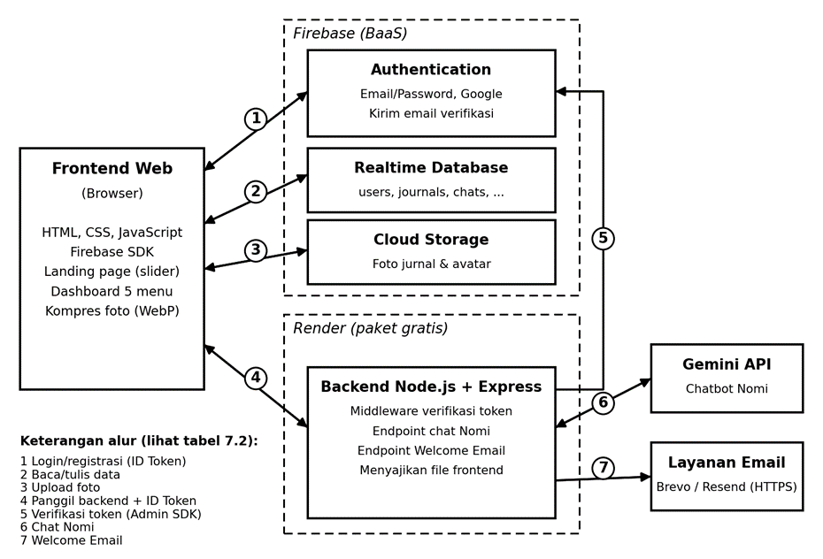

**SENARA**

PODUCT REQUIREMENT DOCUMENT

Rencana Pengembangan dan Rancangan Teknis Website Afirmasi & Jurnal Harian

**Isi dokumen**

**A. Rencana Pengembangan:** 1 Ringkasan Proyek, 2 Persyaratan Teknis, 3 Struktur Halaman dan Fitur, 4 Halaman Registrasi, 5 Dashboard Profile, 6 Pemetaan CRUD.

**B. Rancangan Teknis:** 7 Arsitektur Sistem, 8 Alasan Memilih Arsitektur, 9 Class Diagram, 10 Struktur Database, 11 Cara Mengoptimasi Database, 12 Keputusan dan Catatan untuk Tim.

**A. RENCANA PENGEMBANGAN**

# **1. Ringkasan Proyek**

| **Aspek**        | **Keterangan**                                                                                    |
|------------------|---------------------------------------------------------------------------------------------------|
| **Nama Website** | Senara                                                                                            |
| **Konsep**       | Ruang aman untuk refleksi diri, afirmasi harian, teman bicara virtual, dan jurnal momen berharga. |
| **Tim**          | 2 orang (pengembang dan teman)                                                                    |
| **Deadline**     | 20 Oktober 2026                                                                                   |
| **Karakter AI**  | Nomi, teman bicara virtual yang hangat, empatik, dan menenangkan.                                 |

# **2. Persyaratan Teknis**

Buatlah website berbasis layanan cloud. Layanan cloud yang wajib ada adalah Firebase. Rekan-rekan dapat memilih bahasa pemrograman yang digunakan.  
Requirements:

- Wajib ada total 12 CRUD (misal 3 fungsi create, 3 fungsi read, 3 fungsi update, dan 3 fungsi delete) yang dikoneksikan ke *Firebase Realtime Database*.

- Wajib ada fitur register dan login menggunakan *Firebase Authentication*.

- Wajib ada fitur *webmailer* menggunakan Firebase yaitu setelah user register akan dikirim email untuk verifikasi.

| **Komponen**         | **Ketentuan**                                                                                                                                                                                                    |
|----------------------|------------------------------------------------------------------------------------------------------------------------------------------------------------------------------------------------------------------|
| **Database**         | Firebase Realtime Database                                                                                                                                                                                       |
| **Autentikasi**      | Firebase Auth: login dengan Email & Password, ditambah Login with Google. Login email hanya berhasil jika email sudah diverifikasi.                                                                              |
| **Email**            | Verifikasi email: Firebase Authentication (sendEmailVerification) setelah registrasi. Welcome Email: backend Node.js lewat API email HTTPS (Brevo atau Resend); lihat 8.3 untuk alasan tidak memakai SMTP Gmail. |
| **Penyimpanan Foto** | Firebase Storage (gratis hingga 5 GB); URL foto disimpan di Realtime Database                                                                                                                                    |
| **Chatbot AI**       | Gemini API (dipilih karena gratis)                                                                                                                                                                               |
| **Hosting / Deploy** | Render (paket gratis)                                                                                                                                                                                            |

# **3. Struktur Halaman & Fitur**

## **3.1 Landing Page (Sebelum Login)**

Halaman awal berupa slider geser dengan 3 slide untuk menarik perhatian pengunjung:

| **Slide**   | **Judul**                 | **Isi**                                                                                                                                                                                                                    |
|-------------|---------------------------|----------------------------------------------------------------------------------------------------------------------------------------------------------------------------------------------------------------------------|
| **Slide 1** | Tentang Senara            | Pengenalan singkat Senara sebagai ruang aman untuk refleksi dan afirmasi harian.                                                                                                                                           |
| **Slide 2** | Daily Affirmation Preview | Kutipan afirmasi untuk umum, berganti acak setiap kali halaman dimuat.                                                                                                                                                     |
| **Slide 3** | Mulai / Registrasi        | Tombol aksi cepat ke Registrasi. Tombol Login ("Masuk ke Akunmu") berada di bagian ajakan (CTA) di bawah slider, berdampingan dengan tombol Daftar. Registrasi memicu email verifikasi (Firebase Authentication) dan Welcome Email lewat Web Mailer. Setelah klik link verifikasi, pengguna diarahkan ke halaman Login. |

## **3.2 Main Dashboard (Setelah Login)**

Setelah login, pengguna masuk ke ruang utama Senara yang terdiri dari 5 menu utama. Semua halaman di ruang utama (Dashboard, Nomi, Journaling, Log History, Profile) hanya bisa dibuka oleh pengguna yang sudah login; pengunjung yang belum login atau sudah logout diarahkan ke halaman Login.

### **a. Daily Affirmation (Header / Banner Homepage)**

> • Menampilkan pesan afirmasi harian secara otomatis.
>
> • Tersedia 365 afirmasi berbeda yang dihasilkan AI. Kalimat afirmasi ini disimpan sebagai dataset 365 kalimat afirmasi di Firebase Realtime Database. Setiap kali halaman dimuat atau di-refresh, frontend memilih satu nomor acak dari 1 sampai 365 lalu mengambil kalimat pada nomor itu, dengan syarat tidak sama dengan afirmasi yang terakhir tampil.
>
> • Afirmasi hanya untuk dibaca dan dibagikan (tombol Bagikan); pengguna tidak menyimpan afirmasi ke akunnya.

### **b. Chatbot AI "Nomi" (Gemini API)**

> • Teman bicara virtual yang suportif dan empatik.
>
> • System prompt Gemini diatur agar Nomi berkarakter sebagai pendengar yang hangat, ramah, dan menenangkan.
>
> • Riwayat percakapan disimpan di Realtime Database (chats/{uid}). Frontend menulis pesan pengguna dan balasan Nomi setelah balasan diterima dari backend, sehingga Security Rules per uid tetap berlaku.
>
> • Pengguna dapat menghapus satu pesan atau membersihkan seluruh riwayat percakapan (Delete).

### **c. Journaling (Journaling Your Precious Moment)**

> • Pengguna mengisi form: tanggal, foto (upload), dan catatan. Minimal salah satu dari foto atau catatan harus diisi.
>
> • Menjadi fungsi Create utama pada database.
>
> • Satu tanggal hanya bisa memiliki satu jurnal. Jika tanggal yang dipilih sudah punya jurnal, form membuka mode Edit.

### **Penyimpanan Foto Jurnal (Firebase Storage)**

Karena Firebase sudah dipakai untuk Auth dan Realtime Database, Firebase Storage adalah pilihan utama yang paling pas dan sangat direkomendasikan untuk menyimpan foto. Kapasitas free tier gratis hingga 5 GB, sangat cukup untuk proyek tugas. Catatan: Firebase dapat mewajibkan paket Blaze (kartu kredit) untuk Storage pada project baru, jadi cek dulu di Firebase Console. Jika tidak memungkinkan, ganti dengan layanan gratis lain seperti Cloudinary; rancangan tidak berubah karena database hanya menyimpan URL.

**Alur kerja upload foto:**

> 1\. Pengguna memilih foto di halaman Journaling dari device mereka untuk di upload.
>
> 2\. Frontend otomatis mengecilkan dan mengompres foto di browser pengguna sesuai pengaturan di tabel bawah. Pengguna tidak perlu melakukan apa-apa.
>
> 3\. Frontend mengunggah foto yang sudah dikompres ke Firebase Storage, dengan metadata cacheControl agar browser menyimpan foto dan detail jurnal di Log History terbuka lebih cepat.
>
> 4\. Firebase Storage mengembalikan URL gambar, contoh: https://firebasestorage.googleapis.com/.../photo.jpg
>
> 5\. URL gambar yang berupa teks ini disimpan ke Firebase Realtime Database pada field photoUrl.

**Pengaturan kompres foto (di frontend):**

| **Parameter**                   | **Nilai**             | **Alasan**                                                                                                                     |
|---------------------------------|-----------------------|--------------------------------------------------------------------------------------------------------------------------------|
| **Lebar maksimal**              | 1080 px               | Detail jurnal tampil sekitar 500 sampai 600 px; layar beresolusi tinggi butuh sekitar 2 kali lipat. Di bawah 800 px foto mulai pecah. |
| **Kualitas**                    | 0.8 (80%)             | Hampir tidak terlihat beda dari foto asli. Boleh turun ke 0.7 jika ingin lebih hemat.                                          |
| **Format**                      | WebP (cadangan: JPEG) | Didukung browser modern dan ukurannya lebih kecil.                                                                             |
| **Target ukuran akhir**         | 200 sampai 400 KB     | Foto HP sekitar 5 MB turun ke kisaran ini.                                                                                     |
| **Batas file sebelum kompresi** | 10 MB                 | File di atas batas ditolak.                                                                                                    |

Dengan rata-rata 300 KB per foto, kuota 5 GB muat sekitar 17.000 foto. Jika foto butuh detail tinggi (misalnya tulisan atau dokumen), lebar 1080 px bisa terasa kurang, tetapi untuk momen sehari-hari di Senara pengaturan ini sudah cukup.

### **d. Log History (Tampilan Kalender ala Instagram Archive)**

> • **Tampilan:** grid kalender bulanan yang bersih, tanpa foto di dalam kotak tanggal.
>
> • **Indikator:** tanggal yang memiliki jurnal diberi penanda kecil, misalnya titik warna.
>
> • **Interaksi (Read, Update, Delete):**
>
> – Pengguna mengklik tanggal, lalu detail jurnal tampil di panel di samping kalender (di layar kecil, di bawah kalender) bergaya kartu postingan Instagram: foto di atas, catatan di bawah.
>
> – Di dalam panel detail tersedia tombol Edit (Update) dan Hapus (Delete).
>
> – Jika tanggal yang diklik belum punya jurnal, panel menampilkan ajakan untuk menulis jurnal pada tanggal itu.

### **e. Profile Page**

> • Menampilkan data akun pengguna (nama, email, tanggal mendaftar).
>
> • Fitur update profil. Detail lengkap ada di Bagian 5.

# 

# 

# **4. Halaman Registrasi**

Berikut input form registrasi yang paling ideal beserta fungsinya.

## **4.1 Form Field Utama (Wajib)**

| **Field**               | **Fungsi**                                                                                                                                   |
|-------------------------|----------------------------------------------------------------------------------------------------------------------------------------------|
| **Nama Lengkap**        | Disimpan utuh sebagai nama pengguna dan tampil di halaman Profile. Untuk sapaan personal hanya dipakai nama depannya, misalnya "Seno Prasetyo" menjadi "Hi, Seno!" di Homepage dan Profile, serta sapaan di Welcome Email dari Web Mailer. |
| **Alamat Email**        | Identitas unik login di Firebase Auth dan tujuan pengiriman email dari Web Mailer.                                                           |
| **Password**            | Keamanan akun. Firebase Auth mewajibkan minimal 6 karakter.                                                                                  |
| **Konfirmasi Password** | Validasi di frontend agar pengguna tidak salah ketik password.                                                                               |

## **4.2 Elemen Tambahan pada Form**

> • **Checkbox Syarat & Ketentuan (opsional):** contoh teks "Saya menyetujui Syarat & Ketentuan Senara."
>
> • **Tombol Submit:** "Mulai Bersama Senara".
>
> • **Link Switch:** "Sudah punya akun? Login di sini".
>
> • **Login with Google:** tombol alternatif selain email dan password.

# **5. Dashboard Profile**

Halaman Profile tidak hanya berisi form data diri, tetapi juga menjadi tempat pengguna melihat rangkuman perjalanan emosional dan jurnal mereka. Halaman ini juga memenuhi syarat CRUD (Read & Update data user) di Firebase Realtime Database.

## **5.1 Form Data Diri**

| **Field**                      | **Akses**   | **Keterangan**                                                                                         |
|--------------------------------|-------------|--------------------------------------------------------------------------------------------------------|
| **Nama Lengkap**               | Bisa diubah | Nama depannya dipakai untuk sapaan di Homepage dan Profile ("Hi, Seno").                               |
| **Bio Singkat / Kutipan Diri** | Bisa diubah | Kata-kata motivasi untuk diri sendiri.                                                                 |
| **Foto Profil (Avatar)**       | Bisa diubah | Foto diunggah lewat PhotoService (dikompres, disimpan di Storage); URL disimpan di users/{uid}/avatar. |
| **Alamat Email**               | Read-only   | Menampilkan email terdaftar dari Firebase Auth.                                                        |
| **Tanggal Bergabung**          | Read-only   | Contoh: "Member Senara sejak 28 September 2026".                                                       |

## **5.2 Kartu Ringkasan Aktivitas (Statistik Refleksi)**

Statistik ringkas membuat tampilan profil terasa lebih personal dan profesional.

> • **Streak Refleksi:** jumlah hari berturut-turut pengguna menulis jurnal. Karena tanggal jurnal bisa dipilih mundur, streak dihitung ulang dari journalDates setiap kali jurnal dibuat atau dihapus.

## **5.3 Pengaturan & Aksi Akun**

> • **Simpan Perubahan:** memperbarui data nama, bio, dan avatar ke Realtime Database (Update).
>
> • **Ganti Password:** memicu email reset password bawaan Firebase Auth.
>
> • **Logout:** keluar dari sesi aplikasi.
>
> • **Hapus Akun**: menghapus profil, jurnal, penanda tanggal, riwayat chat, foto di Storage, lalu akun Firebase Auth. Firebase meminta login ulang sebelum akun dihapus, jadi tampilkan konfirmasi dan minta password (atau login Google) lagi.

# **6. Pemetaan CRUD**

| **No. dan Operasi** | **Fungsi dan Fitur**                                       | **Path dan Data (Realtime Database)**                            |
|---------------------|------------------------------------------------------------|------------------------------------------------------------------|
| **Create 1**        | Registrasi: membuat profil pengguna                        | users/{uid}: name, email, createdAt, stats awal                  |
| **Create 2**        | Journaling: menyimpan jurnal baru                          | journals/{uid}/{dateKey} dan journalDates/{uid}/{dateKey}        |
| **Create 3**        | Chat Nomi: menyimpan pesan pengguna dan balasan Nomi       | chats/{uid}/{messageId}                                          |
| **Read 1**          | Log History: membuka jurnal pada tanggal terpilih (panel detail) | journals/{uid}/{dateKey}                                         |
| **Read 2**          | Log History: menampilkan kalender bulanan                  | journalDates/{uid}, query per bulan                              |
| **Read 3**          | Profile: membaca data diri dan statistik                   | users/{uid}                                                      |
| **Update 1**        | Edit jurnal (catatan, foto)                                | journals/{uid}/{dateKey}: note, photoUrl, updatedAt              |
| **Update 2**        | Simpan Perubahan profil (nama lengkap, bio)                | users/{uid}                                                      |
| **Update 3**        | Ganti foto profil (avatar)                                 | users/{uid}/avatar                                               |
| **Delete 1**        | Hapus jurnal di panel detail, termasuk foto di Storage     | journals, journalDates, dan stats                                |
| **Delete 2**        | Hapus satu pesan atau bersihkan riwayat chat Nomi          | chats/{uid}                                                      |
| **Delete 3**        | Hapus akun beserta seluruh datanya                         | users, journals, journalDates, chats, Storage, Firebase Auth     |

Total ada 12 fungsi CRUD (3 Create, 3 Read, 3 Update, 3 Delete) yang seluruhnya terhubung ke Firebase Realtime Database. Pembacaan tambahan seperti afirmasi harian dan riwayat chat tidak dihitung dalam 12 fungsi ini.

**B. RANCANGAN TEKNIS**

# **7. Arsitektur Sistem**

## **7.1 Diagram Arsitektur**

Senara memakai arsitektur klien dengan Firebase sebagai Backend-as-a-Service, ditambah satu backend tipis di Render. Angka pada panah menunjuk ke tabel alur data di bawah diagram.

*Gambar 1. Diagram arsitektur Senara*

**7.2 Alur Data**

| **No** | **Alur** | **Penjelasan** |
|---|---|---|
| **1** | Login dan registrasi | Frontend memanggil Firebase Authentication lewat SDK (email dan password, atau Google). Authentication mengembalikan ID Token yang dipakai untuk akses berikutnya. |
| **2** | Baca dan tulis data | Frontend membaca dan menulis profil, jurnal, afirmasi, dan riwayat chat langsung ke Realtime Database. Security Rules memastikan pengguna hanya bisa mengakses datanya sendiri. |
| **3** | Upload foto | Foto dikompres di browser, lalu diunggah ke firebase storage. URL hasil upload disimpan ke Realtime Database pada field photoUrl. |
| **4** | Panggilan ke backend | Untuk chat Nomi dan pengiriman email, frontend memanggil endpoint backend di Render lewat HTTPS dan menyertakan ID Token. |
| **5** | Verifikasi token | Middleware backend memeriksa keaslian ID Token lewat Firebase Admin SDK sebelum memproses permintaan. |
| **6** | Chat Nomi | Backend mengirim pesan pengguna dan system prompt Nomi ke Gemini API, lalu meneruskan jawabannya ke frontend. |
| **7** | Web Mailer | Email verifikasi (syarat wajib, lewat Firebase): setelah register, frontend memanggil sendEmailVerification() dari Firebase Authentication dengan continueUrl ke halaman Login. Setelah pengguna klik link, ia diarahkan ke halaman Login. Aturan login: berhasil hanya jika emailVerified bernilai true (akun Google dianggap sudah terverifikasi). Jika belum, tampilkan pesan, tombol "Kirim ulang email verifikasi", lalu sign out. Welcome Email: frontend memanggil endpoint backend dengan ID Token; backend mengirim email lewat API email HTTPS (lihat 8.3). Registrasi tidak menunggu email ini selesai. Error handling saat login: Email Enumeration Protection diaktifkan di Firebase Console, sehingga akun tidak ditemukan dan password salah sama-sama dikembalikan sebagai auth/invalid-credential dan ditampilkan dengan satu pesan "Email atau kata sandi salah". Error lain yang ditangani: format email tidak valid (auth/invalid-email), email belum diverifikasi, dan terlalu banyak percobaan (auth/too-many-requests). |

## **7.3 Komponen**

| **Komponen**                | **Peran**                                                                                          | **Teknologi**                                          |
|-----------------------------|----------------------------------------------------------------------------------------------------|--------------------------------------------------------|
| **Frontend Web**            | Landing page (slider 3 slide), dashboard 5 menu, kompres foto sebelum upload                       | HTML, CSS, JavaScript, Firebase SDK                    |
| **Firebase Authentication** | Registrasi, login email dan password, login Google, email verifikasi, reset password               | Firebase Auth                                          |
| **Realtime Database**       | Profil, jurnal, afirmasi, riwayat chat                                                             | Firebase Realtime Database                             |
| **Cloud Storage**           | File foto jurnal (yang sudah dikompres)                                                            | Firebase Storage                                       |
| **Backend**                 | Endpoint chat dan email, verifikasi token, menyimpan rahasia (API key Gemini, kunci layanan email) | Node.js + Express di Render (paket gratis)             |
| **Gemini API**              | Mesin chatbot Nomi, dan pembuat afirmasi baru bila dibutuhkan                                      | Google Gemini API                                      |
| **Layanan Email**           | Mengirim Welcome Email (email verifikasi dikirim langsung oleh Firebase Auth)                      | Brevo atau Resend lewat HTTPS API dari backend Node.js |

Render juga menyajikan file frontend (static), jadi seluruh aplikasi cukup di-deploy dari satu tempat.

## **7.4 Asumsi dan Catatan Diagram**

> • **Frontend:** web biasa (HTML, CSS, JavaScript) yang memakai Firebase SDK. Framework belum ditentukan.
>
> • **Backend:** Node.js dengan Express di Render paket gratis. Diperlukan untuk Web Mailer dan untuk memanggil Gemini API dengan aman.

# **8. Alasan Memilih Arsitektur Ini**

## **8.1 Alasan**

Pilihannya adalah klien + Firebase (BaaS) + backend tipis. Alasannya:

> • **Sesuai persyaratan proyek.** Firebase Auth, Realtime Database, Web Mailer, dan hosting di Render semuanya terpakai langsung tanpa komponen tambahan.
>
> • **Cepat dikerjakan oleh dua orang.** Autentikasi, database, dan penyimpanan file sudah dikelola Firebase, sehingga tim tidak perlu membangun dan memelihara server sendiri. Deadline 20 Oktober 2026 kira-kira tiga minggu dari sekarang.
>
> • Backend tipis tetap perlu untuk dua hal. Pertama, API key Gemini harus rahasia; kalau dipanggil dari browser, key bisa dilihat siapa saja lewat kode atau tab jaringan. Kedua, pengiriman Welcome Email butuh server karena kunci layanan email tidak boleh ada di frontend.
>
> • **Keamanan berlapis.** Security Rules membatasi akses data per pengguna. Backend memverifikasi ID Token, sehingga endpoint chat dan email tidak bisa dipakai orang yang belum login, dan kuota Gemini tidak terkuras oleh pihak luar.
>
> • **Biaya rendah.** Semua layanan punya free tier, sejalan dengan keputusan memakai Gemini karena gratis. Batasnya bisa berubah, jadi cek halaman harga terbaru sebelum rilis.

## **8.2 Alternatif yang Dipertimbangkan**

| **Alternatif**                                             | **Kelebihan**                | **Alasan tidak dipilih**                                                                                                            |
|------------------------------------------------------------|------------------------------|-------------------------------------------------------------------------------------------------------------------------------------|
| **Semua langsung dari frontend, tanpa backend**            | Paling sederhana             | API key Gemini dan kredensial email terekspos, dan Web Mailer tidak bisa berjalan dengan aman.                                      |
| **Backend penuh dengan database sendiri (misalnya MySQL)** | Kontrol penuh atas data      | Harus membangun autentikasi, upload file, dan hosting database sendiri. Bertentangan dengan persyaratan Firebase dan memakan waktu. |
| **Firebase Cloud Functions sebagai backend**               | Terintegrasi dengan Firebase | Persyaratan menyebut hosting di Render. Cloud Functions juga umumnya membutuhkan paket berbayar; cek ketentuan terbaru.             |

## **8.3 Konsekuensi yang Perlu Diketahui**

> • Frontend dan backend di-deploy di satu tempat, yaitu Render. Firebase hanya dipakai sebagai layanan backend (Auth, Realtime Database, Storage), bukan hosting. Karena satu origin, CORS cukup dibatasi ke domain Render Senara.
>
> • Realtime Database tidak mendukung join dan query kompleks. Karena itu struktur datanya dirancang khusus (Bagian 10) dan dioptimasi (Bagian 11).
>
> • Karena tim memakai Render paket gratis, layanan bisa "tidur" saat lama tidak dipakai, sehingga permintaan pertama ke backend (chat Nomi atau email) terasa lambat beberapa detik. Bagian lain tidak terpengaruh karena langsung ke Firebase. Frontend sebaiknya tidak menunggu pengiriman Welcome Email agar registrasi tetap terasa cepat.

Pengiriman email: paket gratis Render diketahui memblokir port SMTP keluar (25, 465, 587), sehingga Nodemailer dengan Gmail berisiko gagal dari sana (cek dokumentasi Render terbaru). Karena itu Welcome Email dikirim lewat API email berbasis HTTPS seperti Brevo atau Resend, yang memiliki kuota gratis (cek batas terbaru). Email verifikasi tidak terpengaruh karena dikirim oleh Firebase.

# **9. Class Diagram**

Kelas dibagi menjadi tiga kelompok: model (data), layanan (logika), dan pendukung. Panah putus-putus menunjukkan dependency (kelas kiri memakai kelas yang ditunjuk).

*Gambar 2. Class diagram Senara*

## **9.1 Kelas Model**

| **Kelas**       | **Peran**                                 | **Keterangan penting**                                                                                                                                                                                                         |
|-----------------|-------------------------------------------|--------------------------------------------------------------------------------------------------------------------------------------------------------------------------------------------------------------------------------|
| **User**        | Data akun dan profil pengguna             | uid berasal dari Firebase Auth dan menjadi kunci utama. name (nama lengkap) dan bio bisa diubah; email dan createdAt hanya dibaca.                                                                                                        |
| **UserStats**   | Ringkasan aktivitas untuk halaman Profile | Berisi streak dan tanggal jurnal terakhir (lastCheckIn). Disimpan agar Profile tidak menghitung ulang dari semua jurnal.                                                                                                    |
| **Journal**     | Satu momen precious                       | dateKey berformat yyyy-mm-dd dan menjadi kunci data (satu jurnal per tanggal untuk setiap pengguna). photoUrl adalah URL dari Storage; storagePath dipakai untuk menghapus file. note berisi catatan momen tersebut. |
| **ChatMessage** | Satu pesan dalam percakapan dengan Nomi   | role bernilai user atau nomi.                                                                                                                                                                                                  |
| **Affirmation** | Satu kalimat afirmasi                     | index bernilai 1 sampai 365 dan menjadi kunci data; afirmasi yang tampil dipilih acak dari index ini setiap halaman dimuat.                                                                                                     |

## **9.2 Kelas Layanan dan Pendukung**

| **Kelas**              | **Tanggung jawab**                                                                                                                                                      | **Berjalan di**              |
|------------------------|-------------------------------------------------------------------------------------------------------------------------------------------------------------------------|------------------------------|
| **AuthService**        | Registrasi, login email dan Google, logout, reset password, mengambil pengguna aktif                                                                                    | Frontend                     |
| **ProfileService**     | Membaca dan memperbarui profil, membaca statistik                                                                                                                       | Frontend                     |
| **JournalService**     | Create, Read (per bulan atau per tanggal), Update, dan Delete jurnal. Jika tanggal yang dipilih sudah punya jurnal, form membuka mode Edit, bukan membuat jurnal kedua. | Frontend                     |
| **PhotoService**       | Mengompres, mengunggah, dan menghapus foto di Storage                                                                                                                   | Frontend                     |
| **AffirmationService** | Mengambil satu afirmasi acak setiap halaman dimuat, tidak sama dengan afirmasi yang terakhir tampil                                                                     | Frontend                     |
| **ChatService**        | Mengirim pesan ke backend dan membaca riwayat chat                                                                                                                      | Frontend (memanggil backend) |
| **MailerService**      | Mengirim Welcome Email                                                                                                                                                  | Backend                      |
| **GeminiClient**       | Memanggil Gemini API dengan system prompt Nomi dan beberapa pesan terakhir                                                                                              | Backend                      |

## **9.3 Relasi Antar Kelas**

> • **User dan Journal (1 ke banyak):** satu pengguna memiliki banyak jurnal, masing-masing untuk tanggal yang berbeda.
>
> • **User dan ChatMessage (1 ke banyak):** satu pengguna memiliki banyak pesan chat.
>
> • **User dan UserStats (composition, 1 ke 1):** statistik adalah bagian dari pengguna dan ikut hilang jika akun dihapus.
>
> • AuthService memakai MailerService: saat registrasi, AuthService memanggil sendEmailVerification (Firebase) dan meminta backend mengirim Welcome Email.
>
> • **JournalService memakai PhotoService:** foto dikompres dan diunggah dulu, baru URL-nya disimpan. Saat jurnal dihapus atau fotonya diganti, file lama dihapus lewat PhotoService.remove.
>
> • **ChatService memakai GeminiClient:** secara teknis lewat HTTP ke backend, karena GeminiClient berjalan di server.

Catatan: JournalService juga memperbarui UserStats setiap kali jurnal dibuat atau dihapus (lihat Bagian 11.4). Panahnya tidak digambar agar diagram tetap rapi.

# **10. Struktur Database (Realtime Database)**

Realtime Database menyimpan data sebagai satu pohon JSON. Rancangan pohonnya:

| users {uid} name, email, bio, avatar, createdAt stats streak, lastCheckIn journals {uid} {dateKey} contoh: 2026-09-29 photoUrl, storagePath, note createdAt, updatedAt journalDates {uid} {dateKey}: true affirmations 1: "teks afirmasi hari ke-1" ... 365: "teks afirmasi hari ke-365" chats {uid} {messageId}: { role, text, timestamp } |
|---|

| **Path**                         | **Isi**                                               | **Kapan dibaca**                               |
|----------------------------------|-------------------------------------------------------|------------------------------------------------|
| **users/{uid}**                  | Profil dan statistik ringkas                          | Saat login dan membuka Profile                 |
| **journals/{uid}/{dateKey}**     | Isi lengkap jurnal pada tanggal itu (dengan photoUrl) | Saat pengguna mengklik tanggal di Log History  |
| **journalDates/{uid}/{dateKey}** | Penanda tanggal yang punya jurnal (bernilai true)     | Saat membuka kalender bulanan                  |
| **affirmations/{1..365}**        | Kalimat afirmasi                                      | Satu node acak setiap halaman dimuat           |
| **chats/{uid}/{messageId}**      | Riwayat percakapan dengan Nomi                        | Saat membuka halaman chat (dibatasi jumlahnya) |

Karena jurnal hanya satu per tanggal, tanggal langsung dipakai sebagai kunci. Dengan begitu journalId tidak diperlukan, dan membuka jurnal pada tanggal tertentu cukup satu baca langsung ke path-nya.

# **11. Cara Mengoptimasi Database**

Realtime Database mengunduh seluruh isi sebuah node yang dibaca, dan tidak punya join. Jadi optimasinya berfokus pada satu hal: membaca sesedikit mungkin data pada setiap aksi.

## **11.1 Struktur datar dan dipisah per pengguna**

Jurnal, profil, dan chat ditaruh di node terpisah, bukan bersarang di dalam users. Dengan begitu membaca profil tidak ikut menarik ratusan jurnal. Path per uid juga membuat Security Rules sederhana.

## **11.2 Kunci tanggal dan query per bulan**

Karena jurnal memakai tanggal sebagai kunci, kalender bulan Oktober cukup mengambil jurnal dengan orderByKey lalu startAt("2026-10-01") dan endAt("2026-10-31"). Query berdasarkan kunci tidak membutuhkan .indexOn tambahan, dan Firebase hanya mengirim jurnal pada rentang itu, bukan semua jurnal.

## **11.3 Penanda kalender yang ringan**

Kalender hanya perlu tahu tanggal mana yang punya jurnal. Node journalDates menyimpan penanda itu sebagai pasangan tanggal dan nilai true, jauh lebih kecil daripada jurnal lengkap. Karena jurnal dan penandanya ditulis di dua tempat, gunakan satu multi-path update supaya keduanya selalu konsisten. Jika tim menilai ukuran jurnal per bulan sudah cukup kecil, node ini bisa dihapus dan kalender langsung membaca jurnal per bulan seperti di 11.2.

## **11.4 Menyimpan ringkasan statistik**

Streak disimpan di users/{uid}/stats dan diperbarui saat jurnal dibuat atau dihapus (dengan transaction atau multi-path update). Halaman Profile cukup membaca satu node kecil, tidak perlu menghitung dari semua jurnal. Untuk streak, hitung ulang dari journalDates karena jurnal bisa diisi untuk tanggal yang sudah lewat.

## **11.5 Foto di Storage, hanya URL di database**

Database hanya menyimpan photoUrl berupa teks. Foto dikompres dulu di frontend (Bagian 3.2c). Saat jurnal dihapus atau fotonya diganti, hapus juga file lamanya di Storage lewat storagePath.

## **11.6 Afirmasi: baca satu node acak**

Setiap kali halaman dimuat, frontend memilih nomor acak 1 sampai 365 lalu mengambil hanya satu node affirmations/{nomor} dengan get() (bukan listener realtime), bukan seluruh 365 kalimat. Nomor afirmasi terakhir disimpan di sessionStorage supaya refresh berikutnya tidak menampilkan kalimat yang sama. Setiap refresh berarti satu kali baca, tetapi ukurannya hanya satu kalimat pendek, dan cara ini tidak memakai kuota Gemini sama sekali.

## **11.7 Pakai get() dan listener dengan tepat**

Listener realtime (onValue) terus menerima pembaruan. Pakai hanya untuk data yang perlu tampil langsung, seperti percakapan chat yang sedang terbuka, dan lepaskan listener (off) saat pengguna pindah halaman. Untuk data statis, pakai get().

## **11.8 Batasi jumlah data yang dibaca**

Baca riwayat chat dengan limitToLast (misalnya 50 pesan). Untuk Gemini, kirim hanya beberapa pesan terakhir (misalnya 10) supaya hemat token dan kuota. Jurnal selalu dibaca per bulan, bukan sekaligus.

## **11.9 Security Rules dan validasi**

Rules membatasi akses per uid dan memvalidasi data supaya tidak ada data sampah atau akses lintas pengguna. Contoh rancangan aturan:

| { "rules": { "users": { "$uid": { ".read": "auth.uid === $uid", ".write": "auth.uid === $uid" } }, "journalDates": { "$uid": { ".read": "auth.uid === $uid", ".write": "auth.uid === $uid" } }, "chats": { "$uid": { ".read": "auth.uid === $uid", ".write": "auth.uid === $uid" } }, "journals": { "$uid": { ".read": "auth.uid === $uid", ".write": "auth.uid === $uid", "$date": { ".validate": "*d**a**t**e*.*m**a**t**c**h**e**s*(/[0 − 9]4 − [0 − 9]2 − [0 − 9]2/)", "note": { ".validate": "newData.isString() && newData.val().length <= 2000" } } } }, "affirmations": { ".read": true, ".write": false } } } |
|---|

Afirmasi dibuat terbuka untuk dibaca karena landing page menampilkan preview afirmasi sebelum login. Isinya tidak sensitif, dan pengguna tidak bisa mengubahnya (".write": false). Dataset 365 afirmasi diisi sekali lewat Firebase Console atau skrip admin.

## **11.10 Pantau batas free tier**

Realtime Database punya batas penyimpanan, unduhan bulanan, dan koneksi bersamaan pada paket gratis. Angkanya bisa berubah, jadi cek halaman harga Firebase terbaru dan pantau penggunaan di Firebase Console selama pengembangan.

## **11.11 Ringkasan Optimasi**

| **Teknik**                                | **Yang dihemat**                                    |
|-------------------------------------------|-----------------------------------------------------|
| **Struktur datar per pengguna**           | Membaca profil tidak menarik data jurnal            |
| **Kunci tanggal + query per bulan**       | Tidak mengunduh semua jurnal untuk membuka kalender |
| **journalDates**                          | Kalender tampil tanpa membaca isi jurnal            |
| **Streak tersimpan**                      | Profile tidak menghitung dari semua jurnal          |
| **Foto di Storage + kompres**             | Ukuran database kecil, penyimpanan foto hemat       |
| **Afirmasi 1 node acak**                  | Satu baca kecil per muat halaman, tanpa kuota Gemini |
| **limitToLast dan pesan Gemini terbatas** | Bandwidth dan token                                 |
| **Security Rules + validate**             | Mencegah data sampah dan akses lintas pengguna      |

# **12. Keputusan dan Catatan untuk Tim**

## **12.1 Keputusan yang Ditetapkan**

> • Deploy tunggal di Render; Firebase dipakai sebagai layanan backend (Auth, Realtime Database, Storage), bukan hosting.
>
> • Email verifikasi memakai Firebase Authentication (sendEmailVerification). Login email diblokir sampai email terverifikasi; login Google dianggap terverifikasi.
>
> • Welcome Email dikirim backend lewat API email HTTPS (Brevo atau Resend), bukan SMTP Gmail, kecuali terbukti port SMTP dapat dipakai.
>
> • Fungsi CRUD mengikuti tabel Bagian 6: 12 fungsi mencakup jurnal, chat Nomi, profil, avatar, dan hapus akun.
>
> • Satu jurnal per tanggal; kunci database berupa dateKey berformat yyyy-mm-dd.
>
> • Afirmasi 365 kalimat diisi sekali lewat Firebase Console atau skrip admin, lalu dibaca satu node acak setiap halaman dimuat. Afirmasi tidak disimpan per pengguna.
>
> • Email Enumeration Protection diaktifkan; login menampilkan satu pesan "Email atau kata sandi salah" untuk akun tidak ditemukan dan password salah.
>
> • Registrasi meminta nama lengkap; sapaan di aplikasi dan Welcome Email hanya memakai nama depan.
>
> • Jurnal berisi tanggal, foto, dan catatan (tanpa field "Kenapa momen ini precious").
>
> • Halaman di ruang utama hanya bisa dibuka setelah login.

## **12.2 Hal yang Dicek Sebelum Mulai Coding**

> • Paket Firebase Storage: apakah project baru wajib Blaze. Jika ya dan tidak diinginkan, pakai Cloudinary atau layanan gratis lain.
>
> • Port SMTP di Render paket gratis dan kuota gratis Brevo atau Resend terbaru.
>
> • Pastikan Email Enumeration Protection sudah aktif di Firebase Console, karena pesan error login mengikuti pengaturan ini.
>
> • Batas free tier Gemini API dan Realtime Database.
>
> • Hapus akun butuh login ulang (recent login); siapkan langkah re-autentikasi.

## **12.3 Jadwal Kasar (Deadline 20 Oktober 2026)**

> • 29 Sep sampai 5 Okt: setup Firebase dan Render, registrasi, login, verifikasi email, halaman Profile.
>
> • 6 sampai 12 Okt: Journaling dan foto, Log History, afirmasi harian, landing page.
>
> • 13 sampai 17 Okt: Nomi (backend dan chat), Welcome Email, hapus akun, Security Rules.
>
> • 18 sampai 19 Okt: pengujian akhir, perbaikan, deploy final. 20 Okt: pengumpulan.
